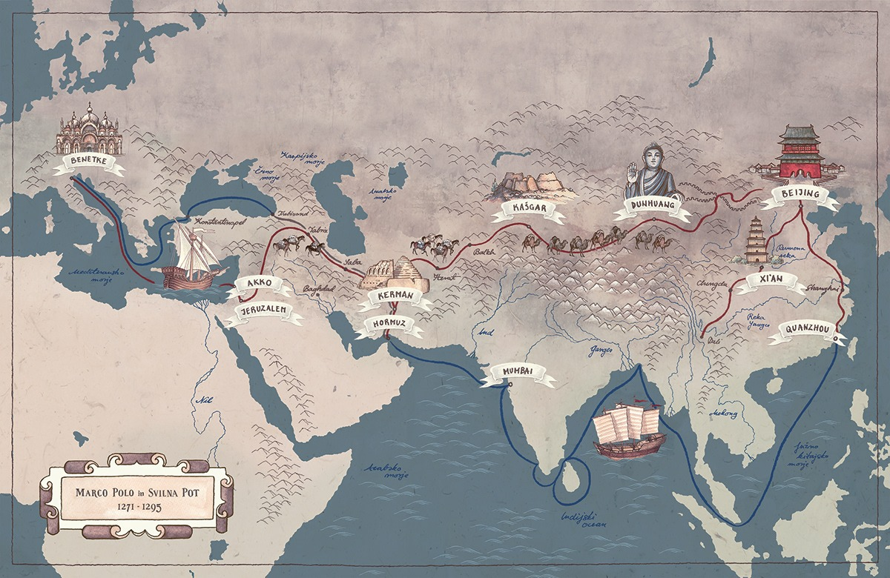

# 第一讲

在 1898 年的一个名为布莱恩维尔-克雷文的法国小镇 [1]，十一岁的马塞尔·杜尚（Marcel Duchamp）第一次与他的两个哥哥，加斯顿，还有雷蒙德下棋。在诺曼底乡下宁静的夜晚，这些小小的对弈，成为了他们的消遣。马塞尔·杜尚思维活跃，充满自信，魅力十足。在他涉猎的任何领域，他都会做的相当出彩。这些特质，无论他到哪里，都会受到大家的喜爱。

他的家族有着深厚的艺术根基。他的两个哥哥，都成了艺术家。他也随着他哥哥们的脚步，刚成年的时候，在巴黎，成为了一个充满抱负的年轻画家。就在短短几年内，杜尚极不寻常的作品开始吸引公众的注意——主要是因为他的绘画风格很难被划分到不同的已知的艺术流派。他跳跃的风格给当时庄严肃穆的艺术界带来了轻快与活力。等他到了 30 岁，他已经成为了当代最有影响力的艺术家之一。

</img>

<i>杜尚的绘画</i>

就在他的事业顶峰期，他彻底迷上了象棋。

爱因斯坦说过：“象棋会缠绕住棋手，变成精神和心灵的锁链。哪怕我们中间内心最强大的人，也必须遭受它的折磨。”

杜尚年轻的时候，他非常喜欢下棋，经常和家人或者朋友对弈。甚至在他的绘画中，也出现了象棋的元素。但是逐渐地，他对象棋的喜爱变成了痴迷。他开始逐步忽视他生活中最主要的事业——艺术、创意、友谊还有爱情。小小的木质棋盘和小小的棋子，似乎对杜尚施下了魔咒，让他无边无际的思绪围绕象棋而转，变成了它的奴隶。

就好比肯尼迪在 60 年代抛弃自己的政治生涯，转而去打台球一样，杜尚在自己的艺术生涯顶点，逐步放弃了绘画。当时的杜尚在巴黎、纽约以及其他城市都是艺术界和上流社会的宠儿。在白天，他会收到不计其数的画廊老板和顾客的爱慕；夜晚，则是在宴会或者自己的工作室度过。他逐渐放弃了这一切，他的时间开始被象棋所充斥。他不再举办宴会，不再作画，日日夜夜，他都在研究棋谱。他还加入了纽约的马歇尔象棋俱乐部，就在华盛顿广场旁边。在那里他会和别人一直对弈到深夜。在阿根廷的两年，他会和在纽约的朋友通过写信的方式下棋。

在他 30 岁出头的时候，杜尚已经彻底完成了转变，他几乎停止了作画。更让他的朋友震惊的是，他说他想成为一名职业棋手。在他 32 岁那一年（1919 年），他说：“我日日夜夜都在下棋，只有研究下棋，才会真正吸引到我”。

</img>

<i>沉迷象棋的杜尚</i>

他的时间几乎全部贡献给了象棋，他甚至都很少有吃饭的时间。在他的公寓里，在咖啡馆，甚至在喧闹的艺术展上，都会见到他和朋友或者陌生人下棋的身影。他告诉朋友们，也许是在告诉自己：“我周围的所有事物，在我眼里都会变成棋子的形状，就像马或者皇后。世俗世界已经没有什么能吸引我的地方了，除非这个世界可以变成一个稳赢或者必输的残局”。

在 1923 年，他到了布鲁塞尔，进一步磨炼自己的象棋生涯。后来他回到了巴黎，一直到深夜都在研究象棋。半夜时分，他会匆匆忙忙的吃上几口炒鸡蛋，喝一些咖啡，然后继续埋头研究棋谱，一直到凌晨四点才会昏昏沉沉的睡去。

就算是爱情也无力对抗他对象棋的痴迷。1927 年，他和年轻的莉迪亚（Lydie Sarazin-Levassor）结婚。在他们的蜜月期间，他花了整整一周的时间研究象棋。被自己丈夫忽视的新娘开始谋划她的复仇。一天深夜，当杜尚终于睡着了，莉迪亚用胶水把所有的棋子都死死的粘到了棋盘上。

六个月后，他俩离婚了 [2]。

## 象棋的历史

最早的象棋（Chess）大致起源历古印度。传入东方，逐步演变成了中国象棋，最有说服力的史料将中国象棋的起源推到了唐朝。随后继续传入日本，演变成了将棋。另一分支向西传播，先是传入波斯，随后到阿拉伯，最后到达欧洲，经过部分改造，变成了现在熟知的国际象棋。

</img>

<i>象棋沿着丝绸之路，在欧亚大陆主要文明之间进行传播</i>

象棋至少已经有 1400 年的历史。据史料记载，在公元 6 世纪左右就已经相当活跃。在印度，象棋被称为 Chaturanga（意为四军，步兵、骑兵、象军、战车）。

</img>

<i>黑天（Krishna，印度教诸神之首）和他的情人罗陀（Radha）正在下棋</i>

随后，象棋传入了临近的波斯，改名成了 shatranj。随着穆斯林的阿拉伯帝国在公元 7 世纪的迅速扩张，阿拉伯帝国征服了波斯，象棋也由此传入了阿拉伯。尽管遭到了不少宗教领袖的抵制，象棋在阿拉伯世界非常流行，特别是在权贵以及文人雅士当中。顶尖的棋手也会受到众人的尊敬 [3]。

</img>

<i>公元 8 至 10 世纪，权倾一时的穆斯林阿拉伯帝国</i>

到了公元 10 世纪左右，象棋从穆斯林帝国传入到了中世纪的欧洲。一直到公元 15 世纪前，象棋都是一个十分缓慢的对战游戏，在当时的规则下，所有的棋子都无法迅速移动，因此棋手会花费大量的时间排兵布阵。文艺复兴时期欧洲出现了大量的声名赫赫的女皇，在 14 世纪到 17 世纪内，出现了近 20 个大权在握的女皇。可能是由于这个原因 [4]，攻击力超群的皇后（Queen）取代了弱小缓慢的士（Conselor）成为了欧洲象棋有别于其他版本象棋的一抹独特风景。

</img>

<i>伊丽莎白一世（Elizabeth I）16 世纪英国的最高统治者。一个典型的女皇形象</i>

经过欧洲的人的改良，相（Bishop）的移动速度大幅增加，配上新增的威力无比的皇后，象棋的对战进程被大大加快。有的甚至在几步之内，就能分出胜负。

</img>

<i>四步将杀（Scholar's mate）白方四步之内就能将军（Checkmate）</i>

## 等级分（Elo Rating）

通过分析你的对弈，等级分可以运用一套数学运算来计算得出，每个棋手都会有一个属于个人的等级分，水平越高，这个分数越高。目前等级分最高的世界纪录保持者是前象棋世界冠军科尔森（Magnus Carlsen）巅峰时期的分数 2882。

</img>

<i>前世界冠军卡尔森</i>

如果你的等级分比对手高了 100 ，那么你有 64% 的可能性会战胜他，如果高了 200，这个概率会变成 76% [5]。

</img>

<i>2023 年 6 月 全世界 Top 10 选手 FIDE 的官方等级分</i>

## 世界国际象棋联合会（FIDE）
世界国际象棋联合会（FIDE，Fédération Internationale des Échecs）成立于 1924 年，法国巴黎。它的地位就像奥运会中的奥组委，负责组织大型国际象棋比赛，包括世界冠军赛，来挑选出象棋世界冠军。

</img>

<i>无处不在的 FIDE 图标，右下角背对的是丁立人，左边是尼波（Ian Nepomniachtchi）</i>

同时 FIDE 还会计算选手的等级分，组织赛事来授予一定级别的选手特级大师（Grand Master）、国际大师（International Master）等荣誉头衔。特级大师头衔是最难获得的，全世界目前有 2000 名左右。

## 主流象棋对战平台

chess.com 拥有一亿的注册用户，是世界上最大的象棋对战平台。虽然是商业化的平台，但是最重要的在线对战功能是免费的。

</img>

<i>全世界最大的象棋对战平台 chess.com</i>

lichess.org 则是世界最知名的的开源象棋对战平台，由非营利组织负责经营和维护。作为 chess.com 最大的竞争对手，lichess 所有功能均免费。

</img>

<i>全世界第二大的象棋对战平台 lichess.org</i>

## 今日 YouTube 频道
GMHikaru：世界顶尖选手之一的中村光（Hikaru Nakamura）目前已经退出职业比赛生涯，专注于象棋竞技的主播。作为曾经的世界第二，他在网上和其他世界顶尖选手的对决，创造性以及激烈程度仍然让人叹为观止。

他的一大爱好是领养（adoption）。这是一个流行在网络象棋圈的一个戏称。当你一连十局击败了你的对手，你就领养了你的对手，你的对手就成了你的 “儿子” 。被 Hikaru “领养的儿子” 不计其数，其中也包括不少实力强劲的特级大师。

他的另外一大爱好是收割（farming），这是另外一个戏称，当你击败你的对手时，你的 Elo 会增加，你的对手 Elo 则会减少。这种行为被称为收割。由于 Hikaru 顶尖的实力，无数的特级大师也惨遭收割。

</img>

<i>象棋世界顶尖选手之一 Hikaru 已经变成了 Twitch 全职主播</i>

## 冷知识

由于网上象棋的兴起，象棋被归入电子竞技类游戏。 2020 年，根据赢得奖金的总数，有两位象棋选手入选了 Top 10 电竞玩家 [6]，分别是 Magnus 以及 Hikaru。

</img>

<i>2020 年全世界 Top 10 赢得奖金的电竞玩家</i>

## 参考文献
[1] Shenk, David. The Immortal Game: A History of Chess. Souvenir, 2008. 
[2] “Marcel Duchamp.” Wikipedia, 18 Feb. 2024, en.wikipedia.org/wiki/Marcel_Duchamp#Personal_life.
[3] Salloum, Habeeb. “Arab Contributions to the Game of Chess.” Arab America, 17 Oct. 2016, www.arabamerica.com/arab-contributions-game-chess.
[4] Yalom, Marilyn. Birth of the Chess Queen: A History. 2004
[5]“Elo Rating System - Chess Terms.” Chess.com, www.chess.com/terms/elo-rating-chess.
[6] Murray, Trent. “Top 10 Esports Players of 2020 by Total Prize Winnings.” ARCHIVE - The Esports Observer – ARCHIVE - The Esports Observer, 2 Jan. 2021, archive.esportsobserver.com/top10-esports-players-2020.
