# 第七讲

Kasporov 回想他和他的对手前面的五局比赛。他发现对手在行棋方面并没有惊人的洞察力，下的只能说是普普通通。但是令 Kasporov 胆寒的，是他的对手从不犯错，更要命的是，你不能有任何失误，任何一个小小的战术瑕疵，都会被这个细心的对手咬住不放，你会为你的失误付出惨痛的代价。在巨大的精神压力下，Kasporov 同意对手提出的和棋。比赛以平局告终。

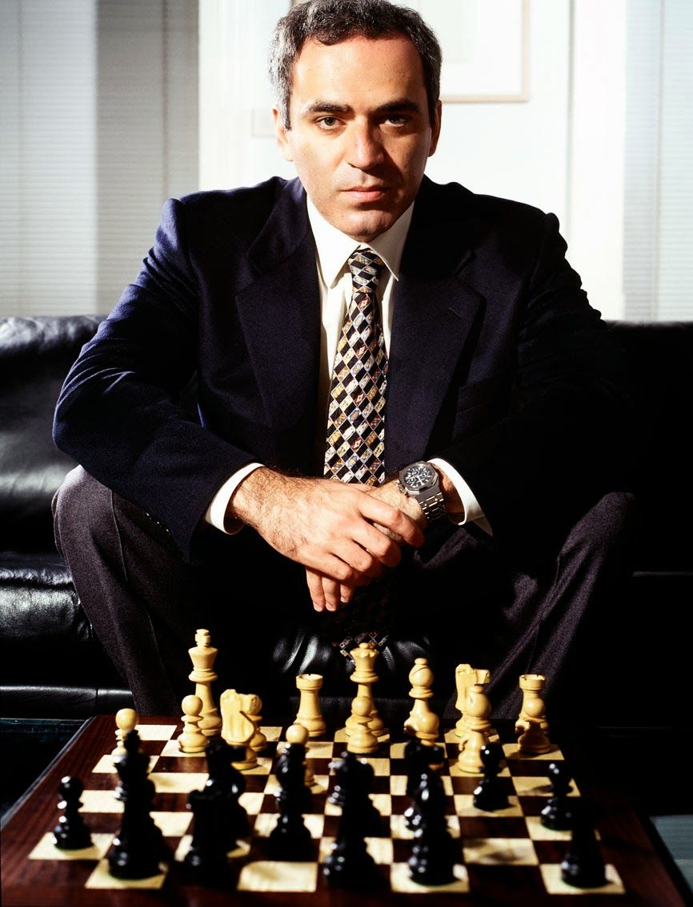
</img>

<i>Kasporov 是当时有史以来最强大的棋手，最高等级分为 2856，这个记录直到被后来的 Magnus Carlsen 打破</i>

他的对手是一个名为 Deep Junior 的电脑程序。

自打 6 年前的那场败给了深蓝（Deep Blue）的耻辱， Kasporov 耿耿于怀，一直在指责 IBM 打造的电脑深蓝藏有猫腻。2003 年的他迎来了一场光明正大的报仇的机会。FIDE 提供了一百万美元的奖金，让当时的顶级电脑程序 Deep Junior 和 Kasporov 来一场世纪对决 [1]。

在第五局的时候，Deep Junior 送给了 Kasporov 一个 “希腊人的礼物”（The Greek Gift）。这是一个常见的牺牲相（Bishop）的战法，名字源于古希腊的特洛伊木马。这一步震惊到了所有的人，包括 Kasporov。这很难不让人联想到 6 年前的 Deep Blue，在最后一局，也是牺牲了棋子，打败了 Kasporov。在被将军的巨大风险的压力下，他不愿继续战斗下去，短短的 19 步，双方就和棋了。

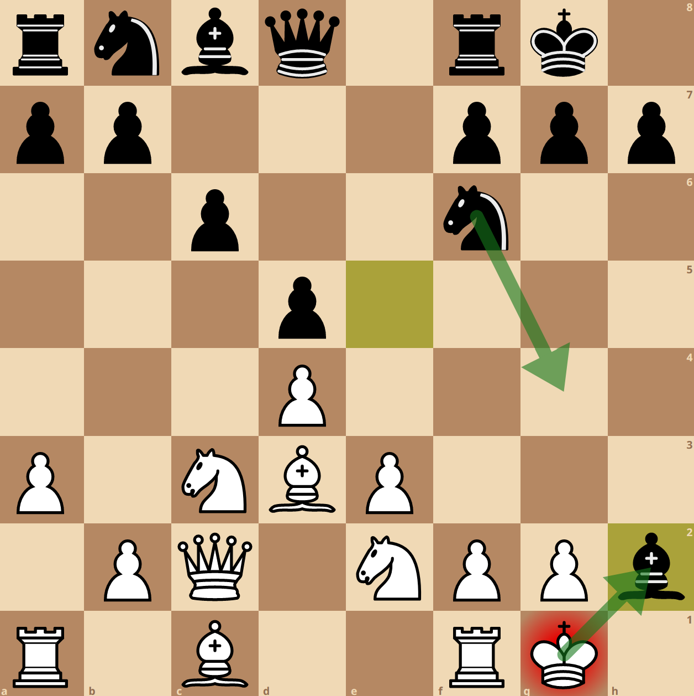
</img>

<i>在第五局的第十步，Deep Junior 选择了 Bxh2+，牺牲了自己的相，这一步也被称为 “希腊人的礼物”</i>

到了第六局，令所有人吃惊的是，在占有微弱优势的情况下，Kasporov 同意了 Deep Junior 团队提出的和棋。事后被追问为什么同意了和棋，Kasporov 回答到 [2]

> ......对于人类棋手这是个巨大的精神负担，哪怕我赢面很大，但只要你出现了一个失误，你就完蛋了，就一个失误而已。如果我的对手是人类的话，我会继续下下去，因为双方你来我往，都会犯错，但是在这里（我的对手不会犯错），一个失误就全盘皆输......

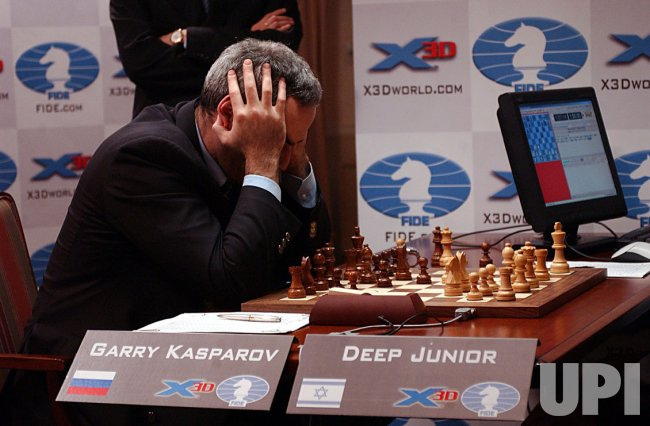
</img>

<i>Kasporov 和来自以色列的电脑程序 Deep Junior 下棋。Deep Junior 是当时最顶尖的象棋程序</i>

比赛结束后，Kasporov 祝贺了以色列研究团队出色的研究成果，并拿走了属于他的 75 万美元的奖金。据估计，第六场比赛，全世界大概有两到三亿观众观看了比赛直播 [3]。

Kasporov 比较了一下象棋程序和人类棋手的差异 [2]

> 这是人类的直觉和机器的计算蛮力之间的较量......我们想要了解我们的直觉到底有多少能被蛮力的计算所匹敌......这只是一个漫长道路的开始。

由于最后一局比赛（第六局）Kasporov 接受了和棋，而没有继续下下去，受到了不少指责。Kasporov 反驳道 [2]

> 电脑可不知道赢和输的区别，也根本不关心我们之前下的（那五局比赛）。第六局我占有微弱的优势，人们指责我说接受了和棋，这可不仅仅是一盘棋那么简单，这是最后一场比赛，我怎么下的前五局会被人们铭记。第三场比赛结束的时候，我根本睡不着，一直在回想着我犯下的巨大的失误，我本来可以赢得第三场比赛，或者随后（在微弱的劣势下）可以平局，作为一个人，满心的五味杂陈给我带来了巨大的精神压力，而且更令人恼火的是，你的（电脑程序）对手不会被相同的情绪和疲倦所困扰。

自打那次比赛结束后，象棋程序越来越强大，目前最顶尖的象棋程序使用了最先进的深度神经网络，等级分超过了 3600 [4]，最顶尖的人类棋手等级分只有 2850 左右。

## 今日明星- Rook

车（Rook）形如一个塔楼，是仅次于皇后的攻击力第二强的战斗部队，属于重型火力部队。皇后和车是唯二可以配合国王将孤王将军的棋子。

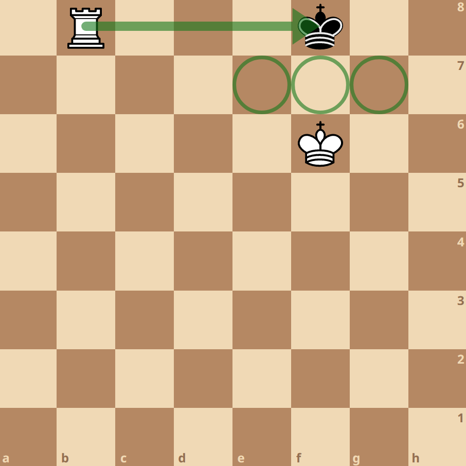
</img>

<i>利用车和王将孤王将军</i>

当两个车叠罗汉的时候，会对敌方施加强大的军事压力，这个时候，敌方也会被迫将自己的车叠罗汉以应对威胁。

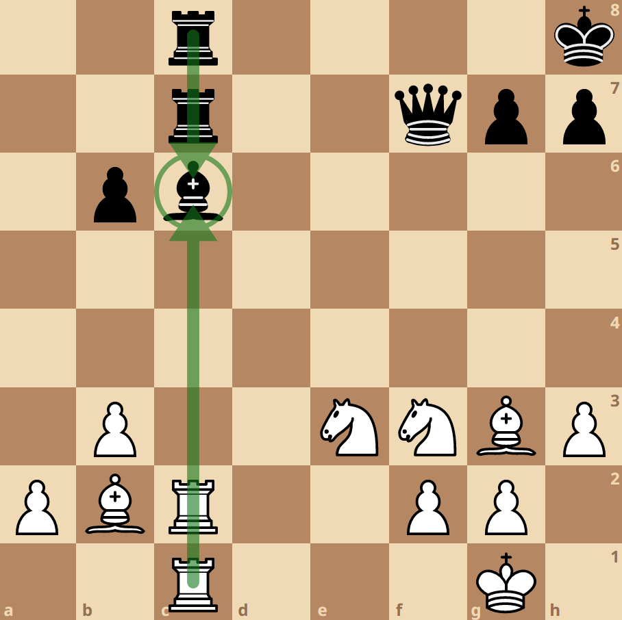
</img>

<i>白方的叠罗汉的车对黑方的象施加了强大的军事压力，黑方不得不同样将自己的车叠罗汉以增加火力支援</i>

如果把皇后这个重火力也加入到叠罗汉，那么我们获得了一个被称为阿列钦大炮（Alekhine's gun）的组合方式。这个闻名遐迩的叠罗汉起源于 1930 年在一场比赛中阿列钦使用这个叠罗汉击败了顶尖棋手尼姆佐维奇(Aron Nimzowitsch)

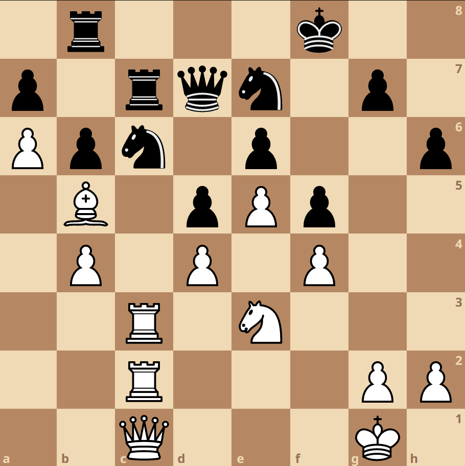
</img>

<i>阿列钦 vs 尼姆佐维奇, San Remo, 1930, 第 26 步</i>

在残局的时候，最常见的做法是，车会调到兵的后面，提供火力支援，协助兵的升变。

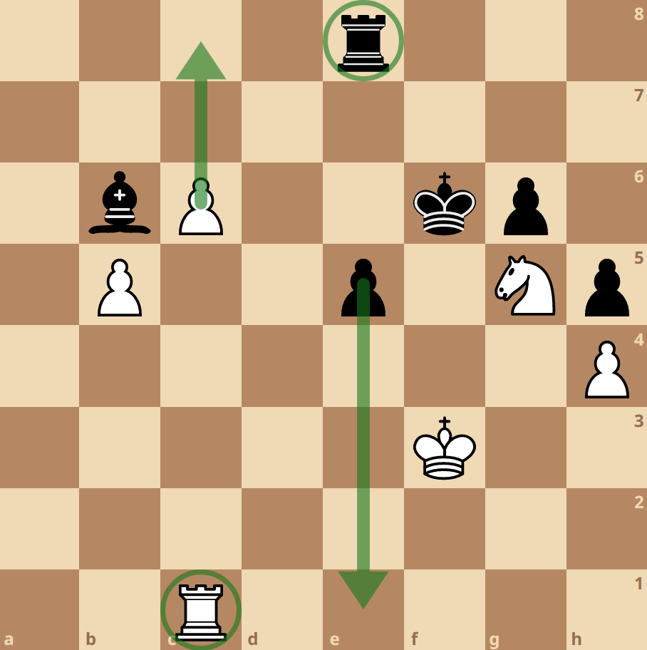
</img>

<i>黑方和白方均将车调到了兵的后方, 以协助升变</i>

## 国际象棋变种- 4 Player Chess

四人国际象棋（4 Player Chess）存在两种对战方式：

1. 混战
混战的四方可以按照战局变化自由结盟. 对于高水平作战, 蓝绿一开始会结盟, 红黄会结盟, 两大集团进行 PK, 直至一方出局. 随后的三国局面则是两个最弱小的吴蜀结盟对付最强大的魏. 在这种玩法下, 背叛和背后捅刀子也已经是见怪不怪.

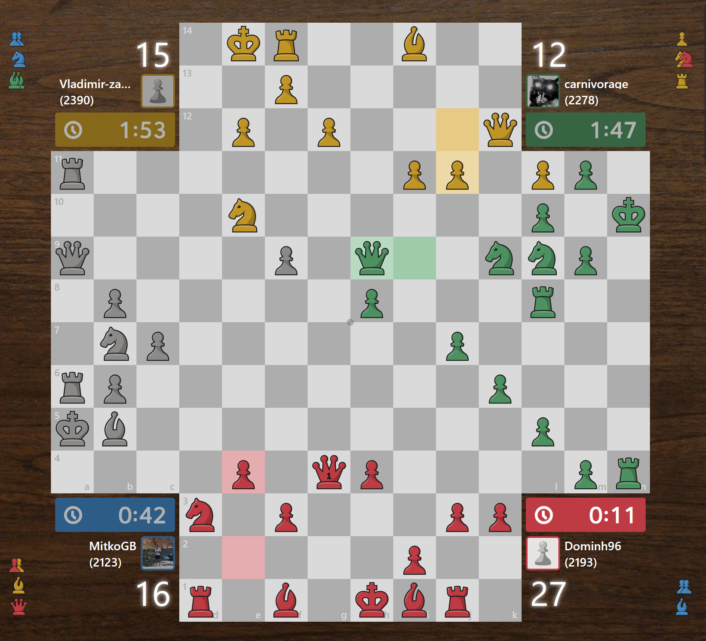
</img>

<i>蓝方淘汰出局,目前打成一个三国局面</i>

2. 2v2 团战
团战模式下, 蓝绿结盟, 红黄结盟, 两大联盟以团队为单位, 进行对决. 一旦盟友被将死, 这个联盟也就打输了.

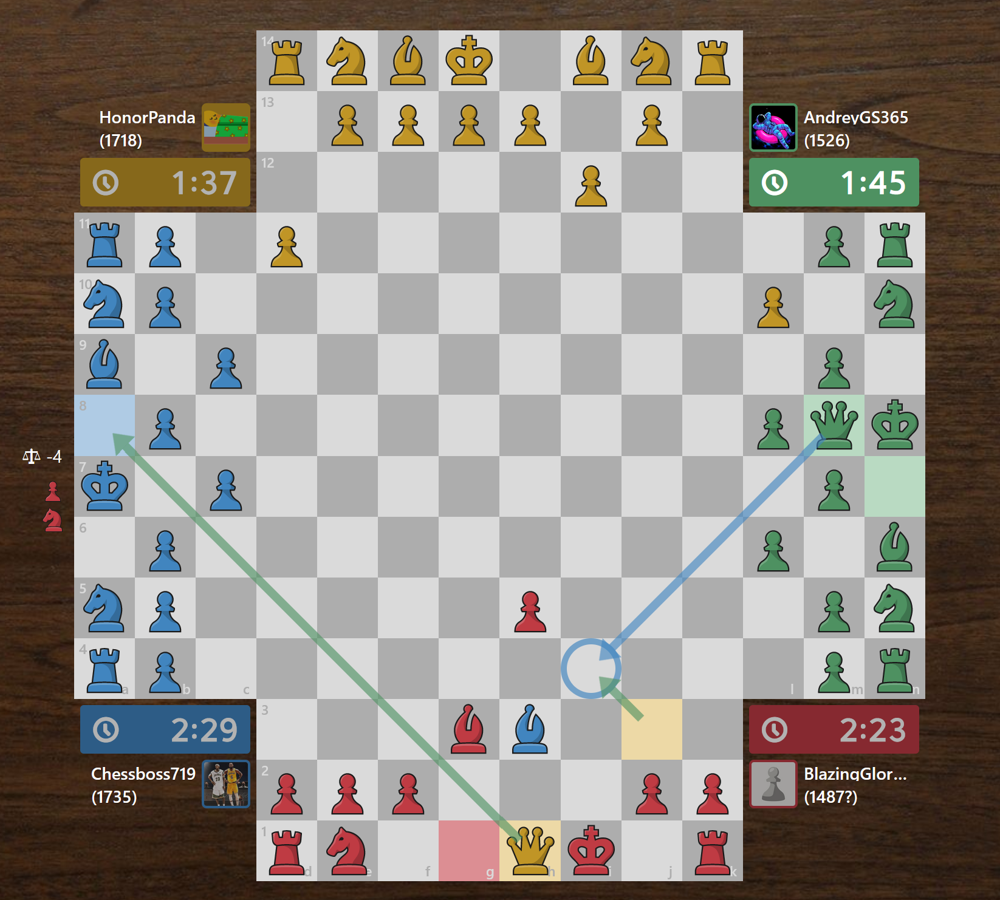
</img>

<i>红黄互为队友, 蓝绿互为队友. 队友可以在棋盘上标注箭头来沟通作战方案, 己方的箭头敌方不可见</i>

chess.com 在 2018 年举办了首届四人象棋世界冠军争霸赛.

## 实用工具
https://lichess.org/editor 是一个在 lichess 上的棋盘分析工具，可以用来帮助分析战局。它的核心是一个功能强大的象棋对战程序，对于每一种战局形式，都可以用数值（Evaluation）来代表双方的优势和劣势，并指出最优的下一步行棋。你也可以随意摆放棋子，让程序计算出你的战局估值

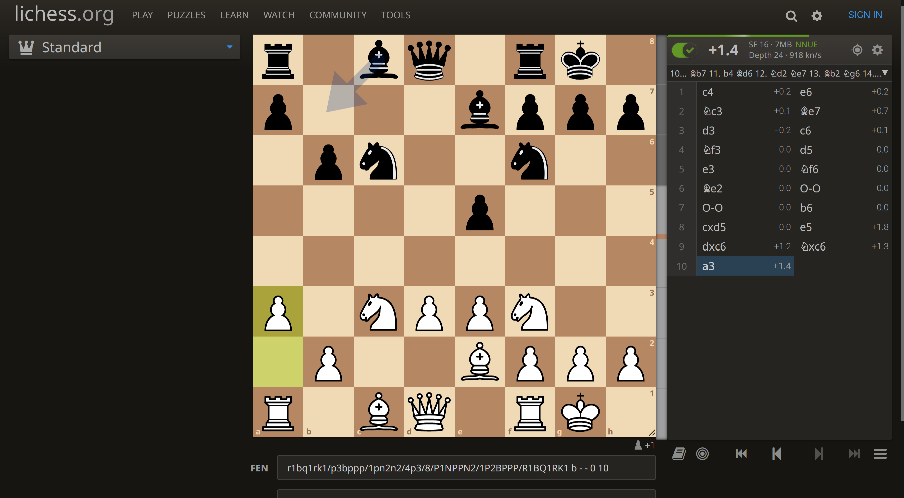
</img>

<i>lichess 的对战程序可以估计出你当前的优势程度，以及提供最佳的下一步行棋参考</i>

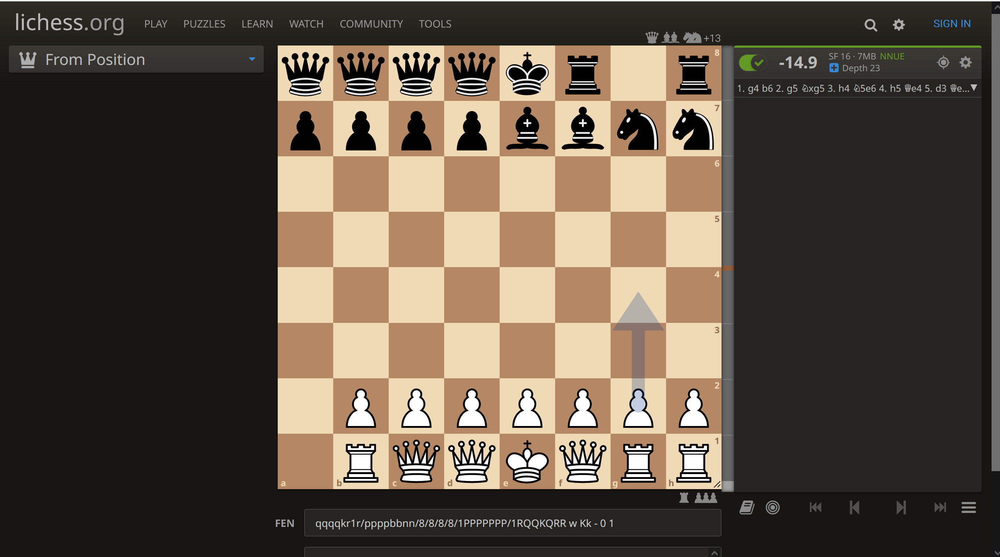
</img>

<i>你也可以随意摆放棋子，lichess 的对战程序仍然可以分析战局</i>

## 冷知识

László Polgár 是匈牙利的一个棋手兼心理学家，在研究了 400 多名天才的传记后, 他坚信 “天才是锻造出来的，不是天生的”，而且认为培养方式的当，任何一个健全的儿童都可以变成天才。为了证实自己的猜想，上世纪 70 年代，他做了一个大胆的实验。他在结婚之前，宣布要把自己未来的孩子培养成天才 [5]。他的三个女儿，日后都成了世界一流的棋手，Zsuzsa 是世界第二强的女性棋手；Judit Polgár，则成了人类历史上唯一一个挺进世界前 10 的女性棋手。

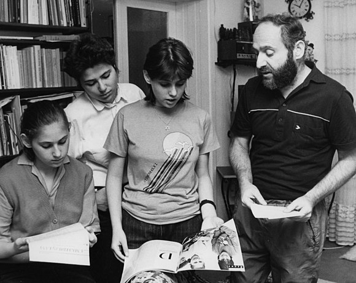
</img>

<i>三个女儿 Judit, Zsuzsa, Zsófia 以及她们的父亲 Laszlo Polgars</i>

## 参考文献
[1] Newborn, Monty, and Monty Newborn. "2003: Deep Junior Confounds Kasparov, Drawing 3–3 in New York." Beyond Deep Blue: Chess in the Stratosphere (2011): 71-81.
[2] CNN.com - Kasparov: “Intuition Versus the Brute Force of Calculation” - Feb. 10, 2003. 7 Feb. 2003, edition.cnn.com/2003/TECH/fun.games/02/08/cnna.kasparov.
[3] Shenk, David. The Immortal Game: A History of Chess. Souvenir, 2008. 
[4] https://www.rankred.com/chess-engines/
[5] https://en.wikipedia.org/wiki/L%C3%A1szl%C3%B3_Polg%C3%A1r