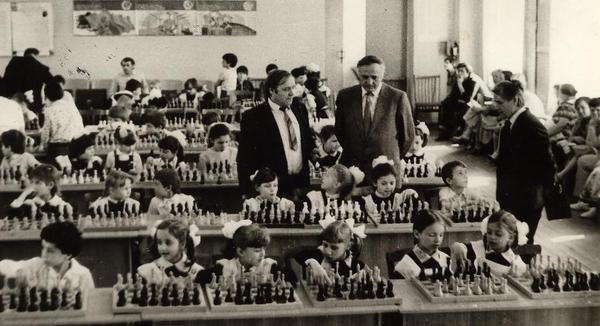

# 第三讲

象棋世界冠军鲍里斯·斯帕斯基（Boris Spassky）坐在棋盘前，神情显得有点不安 [1]。他的对面是一个空荡荡的椅子。他的对手并没有按时到达比赛现场。比赛开始的五分钟后，斯帕斯基离开了现场。台下大概一千名观众，安静的坐着，没有任何交头接耳，整整一小时，默默的盯着台上两个空荡荡的椅子。一小时过后，斯帕斯基回到了台上，当裁判宣布他赢得了这一场比赛，台下的观起身喝彩。看到这一切，斯帕斯基悄悄地对裁判耳语：“真是可惜”。

</img>

<i>第二局比赛费舍放弃出席</i>

这是 1972 年，在冰岛首都雷克雅未克举办的的象棋世界冠军争夺赛。来自美国的年轻棋手鲍比·费舍（Bobby Fischer）挑战现任世界冠军，来自苏联的鲍里斯·斯帕斯基。这场对决被称为“世纪之战”。象棋，这个小众的爱好，突然被推到了聚光灯下，被全世界的主流媒体报道。当时正值冷战的高峰期，美苏双方全方位的竞争得热火朝天：太空竞赛、军备竞赛、意识形态竞争......所有人都能看出这场比赛，象征着美苏双方的国家荣誉。

</img>

<i>第十局比赛，斯帕斯基没能找到和棋的关键步骤，输了这一局</i>

自打 1948 年，24 年内，苏联选手一直垄断了象棋世界冠军的名号，象棋对于俄国人，就像乒乓球对于中国人，足球对于巴西人，橄榄球对于美国人一样，是一项全民运动。苏联政府也一直精心培育他们的国家队。全民的热爱配合上政府的全力支持，造就了威名远扬的苏联学派，苏联选手一直霸占着世界象棋比赛的顶尖赛事。不过，年轻的美国选手费舍打算从俄国人手里夺走世界冠军的称号。

</img>

<i>苏联政府非常重视象棋，从小就培育和选拔有潜力的棋手</i>

</img>

<i>苏联的学校在教授象棋</i>

事实上，费舍对于这场比赛颇有抵触。他先是抱怨奖金太低。为了让他参赛，举办方被迫大幅增加了奖金。这件事甚至惊动了美国政府最高决策层。总统尼克松给他寄了一封亲笔信鼓励他参赛。时任国务卿基辛格亲自打电话给费舍，并大骂到：“......你这个混蛋抓紧到冰岛去”。到了冰岛后，费舍又在抱怨摄像机打扰了他的思考。为了表示抗议，费舍直接拒绝参加第二场比赛，也就是文中一开头描述的那样。

费舍一直都有点古怪，有点不太合群，但是在象棋的天赋上，从小被教练认为是一个天才。他有着极其强烈的竞争欲。他说过：“让我回味无穷的，就是击垮对手自信那一瞬间”。他一直密切关注着苏联媒体，甚至为了获取第一手资料，自学俄语。他的的目标只有一个：击败俄国人。费舍的确击败了斯帕斯基，赢得了 1972 年世界冠军。费舍变成了美国的国家英雄。由于这场世纪之战，全世界下棋的人数大幅增加。不过自打这以后，费舍整整 20 年都没在任何公众赛事上现身。

</img>

<i>赢得世界冠军称号后，费舍被各大主流媒体邀请上电视</i>

再次现身的费舍，由于缺乏收入，无视美国政府的警告，冒着被判刑十年的风险，前往被联合国制裁的南斯拉夫，参与和他 20 年前的对手斯帕斯基的竞赛，并赢得了 300 万美元的奖金。自打这次事件，费舍变成了美国政府通缉的逃犯，离开了美国，并在世界其他国家周转，躲避抓捕。最终病死在了冰岛。

## 今日明星-Queen

皇后（Queen）是第二高的棋子，带着圆形的皇冠，由于和国王长得差不多，因此很容易被搞混。皇后是欧洲人在公元 16 世纪左右，对士（Counsellor）的改良。改良后的皇后威力极大，成为了棋子中的重型火力部队。正是因为国王躲起来，而他老婆却在战场上厮杀，国王也成了国际象棋界久盛不衰的笑柄。

</img>

<i>这个著名的表情包用来嘲讽虚弱的国王</i>

由于王后极具攻击力，因此也成为了最宝贵的战斗主力，因此，棋手一般会将皇后置于棋盘边缘，远离厮杀激烈的棋盘中心，以保护皇后

</img>

<i>皇后一般会远离棋盘中心，保护自己的同时，在边缘施加自己强大的影响力</i>

皇后最主要的战斗目标是利用自己灵活的走位，骚扰敌军，以及配合其他棋子，将敌方将军。

</img>

<i>皇后在车的帮助下，将死了黑方国王</i>

有的时候，棋手会在综合考虑后，牺牲掉自己的皇后，换掉敌方其他低价值的棋子，改善自己的战局。正是由于皇后的巨大价值，牺牲皇后的打法是棋手展现自己勇气和创造力的绝佳战术，一直被人们津津乐道，甚至会名流千古。下图展示了著名的 Opera Game，是 19 世纪著名的天才棋手墨菲（Paul Morphy）在一个歌剧院闲来无聊和两个宫廷贵族的对弈

</img>

<i>随后，黑方的马吃掉了白方皇后，白车到 d8，将死黑方</i>

</img>

<i>墨菲在 19 世纪曾经几乎击败了当时世界上所有的特级大师，他对象棋的洞察力远远超过他所处的时代</i>

## 国际象棋变种-Horde

兽群冲锋（Horde）分为进攻方/白方，和防御方/黑方，白方统领超过半个屏幕的小兵，目的是对黑方将军；黑方则利用常规的棋子，阻挡进攻方里用人海战术进行“兽群冲锋”

</img>

<i>白方利用人海战术击垮黑方，一旦小兵全部阵亡，则宣告失败；如果能利用它们将黑方将军，则胜利</i>

</img>

<i>白方小兵几乎已经损失殆尽，黑方将会取得最终的胜利</i>

</img>

<i>白方吃掉了全部的黑方棋子，黑方无力阻止更多的白棋小兵的升变，随后几步会被白方将军。</i>

Dunsany 公爵于 1942 年首次发表了这个新的象棋变种

</img>

<i>Dunsany 公爵是一位作家，也擅长写戏剧作品。他是爱尔兰的全国象棋冠军。参加过大英帝国在南非的的二次布尔战争和第一次世界大战。</i>

## 今日 YouTube 频道
GothamChess：这个频道是 YouTube 中订阅量最大的象棋类频道，远超他在 YouTube 上的其他竞争对手，有 400 万订阅者。他的频道更是 YouTube 有史以来第一个观看量超过 10 亿次的象棋频道。主播是一个 IM（International Master） ，这个频道的特点是探索一切与象棋的新玩法，各种顶尖象棋竞技界的新闻。他的风趣和幽默的内容让无数人爱上了象棋。

他在 2023 年推出了自己的书 _How to Win at Chess: The Ultimate Guide for Beginners and Beyond_。借助他强大的影响力，这本书成为了纽约时报畅销书之一。

</img>

<i>GothamChess 的频道充满了风趣和创造力</i>

## 冷知识

1994 年，塔利班（Taliban）政权禁止阿富汗民众下象棋，原因是因为塔利班领袖认为下象棋是一种赌博行为，而且浪费了祈祷的时间。当时阿富汗是世界上唯一一个下棋属于违法行为的地方。2002 年，喀布尔一个商人和家人下棋的时候被发现，棋盘被塔利班烧掉，而且还进监狱关押了两天 [2]。

事实上，穆斯林宗教领袖对于象棋的态度一直是爱恨交织。伊斯兰最早的诸多哈里发都有精湛的棋艺，过去几百年穆斯林宗教领袖对于象棋也是时不时的禁止 [3]。

</img>

<i>塔利班的旗帜</i>

## 参考文献
[1] Brady, Frank. Endgame: Bobby Fischer’s Remarkable Rise and Fall - From America’s Brightest Prodigy to the Edge of Madness. Crown, 2012.
[2] Cockburn, Patrick. “The Taliban’s War on Chess - CounterPunch.org.” CounterPunch.org, 7 Feb. 2002, www.counterpunch.org/2002/02/07/the-taliban-s-war-on-chess.
[3] Shenk, David. The Immortal Game: A History of Chess. Souvenir, 2008. 