# 第二讲

巨大的石块，遍地被砍下的头颅，冒着火焰的滚烫的热油在巴格达从天而降 [1]。这里是庞大的伊斯兰帝国的首都。疲惫不堪的守卫拼命的加固城门和城墙。城外，重型投石车往城墙内投下木制的炮弹，攻击城内的建筑物。更精准的，更小的轻型投石枪则将葡萄大小的石块射向城墙上的守卫。远处的弓箭手发射一阵又一阵的箭雨，骑兵部队则用剑和长矛袭击步兵。诗人阿尔胡拉米伤痛地写下：“战马活活将勇敢的士兵乱蹄踩死，一片血肉模糊.......”。圆形的巴格达的城墙有 30 米高，50 米厚，有 9 公里长。攻城的士兵们用沉重的木棒不停的砸向城门；其他的小队则堵住了援军通往城内的的通道和补给。底格里斯河上到处是燃烧的战舰和漂浮的尸体。

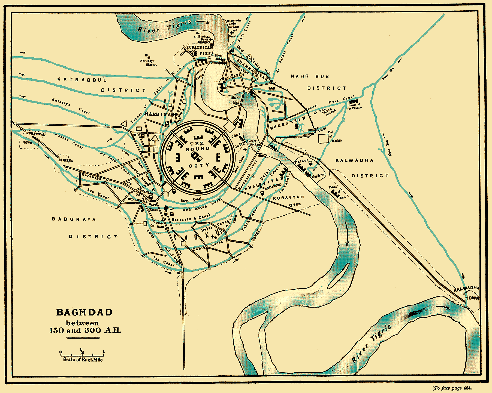
</img>

<i>公元 9 世纪的巴格达</i>

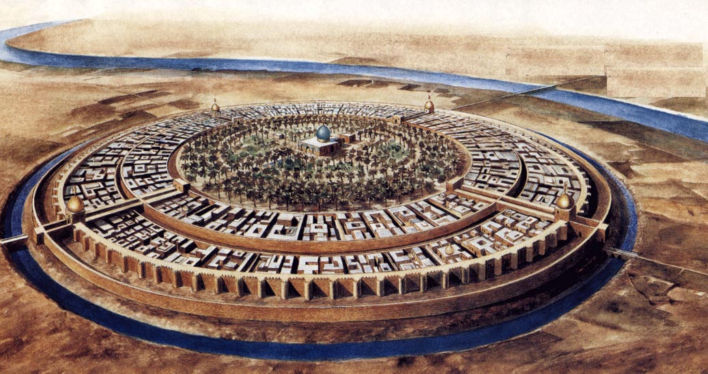
</img>

<i>著名的巴格达圆形城墙</i>

曾经一度被视为无法攻克的“和平之城”，就要被攻陷了。自打这座城市在公元 762 年诞生起，半个世纪内，这座城市的繁荣和声誉可以和君士坦丁堡和罗马相提并论。艺术、科学在这里茁壮成长，同时这也是一个熙熙攘攘的商业中心，著名的丝绸之路便从此通过；往来于中原、中亚、非洲以及欧洲的商队络绎不绝。但是到了公元 813 年。在帝国皇室家族们的内战中，这个文明遐迩的首都已经变成了一片充满着饥饿和死亡的废墟。

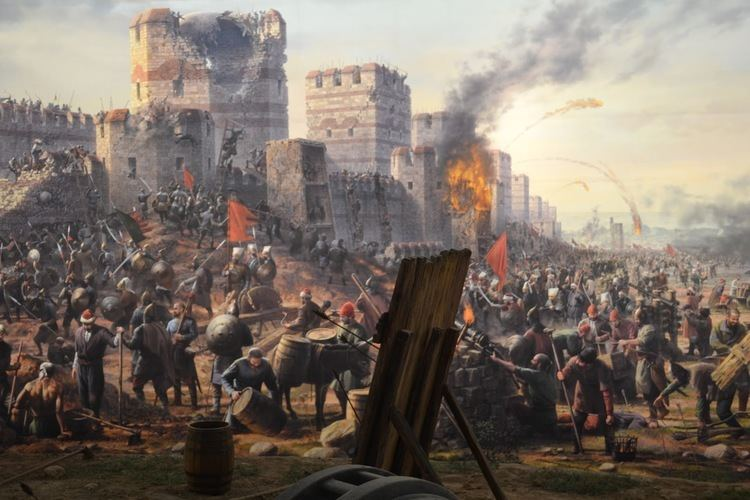
</img>

<i>被包围的的巴格达</i>

就在这场战争的混乱中，人们绝望的期盼着秩序的重建，哪怕不是在这个物质的现实世界，至少是精神世界。就在城外的投石车，弓弩手以及骑兵围攻巴格达时，被严格守卫的皇宫内，也就是这个城市的核心，正在进行着另一场激烈的战争。在金门圣殿璀璨绿色穹顶下，穆罕默德-阿拉米，阿拔斯王朝（在古中国被称为黑衣大食，曾为争夺在西域的影响力和唐朝爆发过著名的怛罗斯战役，唐军大败）的第六任哈里发。他继承了先知默罕默德的衣钵，统治着人类历史上最庞大的帝国之一。但是在这个危急关头，他正在和他最喜欢的宦官库萨下棋。

</img>

<i>阿拔斯王朝控制的疆域</i>

一个密使带着坏消息急急忙忙的闯进了宫殿内，战场失利的消息一个接一个传到哈里发的耳朵里。事实上，一旦战败，哈里发的性命也危在旦夕。但是他摆摆手，试图打发走密使，他根本没兴趣接受这些坏消息。

中世纪的伊斯兰历史学家征哲祭斯-阿玛肯描述了如下这段对话。

密使说到：“统帅殿下，现在不是下棋的时间，请您起身去关注更紧迫的事情”。可是哈里发并没有搭理他，他完全沉浸在这场对弈中。就像任何一个棋手的妻子所了解的，一个正在进行中的对弈就是一个自成一体的世界，这个世界不会被自己孩子的啼哭打扰，不会被含情脉脉的示意所引诱，就哈里发而言，就连迫在眉睫的战败也无法打扰他下棋的兴致。外面的世界越混乱，象棋的世界就越发凸显出整洁和秩序，也许这也是为什么在他意识到自己生命正在倒计时，哈里发选择沉浸在了象棋的世界中。在棋盘上，他可以掌控战场全局，他可以筹划未来，在这场象棋的对弈中，他也许能赢。

密使站在哈里发的身边，但似乎他们却是相隔在两个不同的世界。

“耐心一点”，哈里发说道，“就在几步之后，我就能将军了”。不久后，哈里发就被敌军抓住了，虽然他赢了他人生中最后一盘棋，很快他就被敌军斩首了。

## 今日明星-King

国王（King）一般是棋盘上最高的棋子，头上镶嵌了一副十字架。颇具讽刺意味的是，威严高大的一国之君，在棋盘上却是个出了名的胆小鬼。双方的军队在棋盘上激烈厮杀的时候，国王在战场中间会变得非常脆弱，因此，棋手会选择尽早王车易位（Castling），也就是让国王躲在角落里。

一般来说，短易位更快，因此成为了最流行的易位方式。易位方式会导致战场局势发生改变。易位之后，国王前面的三个小兵成为了保护罩，变成了守卫王宫的禁军。一旦这三个小兵挪动距离过大，会导致国王守备力量空虚，因此棋手不会轻易移动这些禁军。当双方采用非对称的易位方式，战局会变得刺激的多。

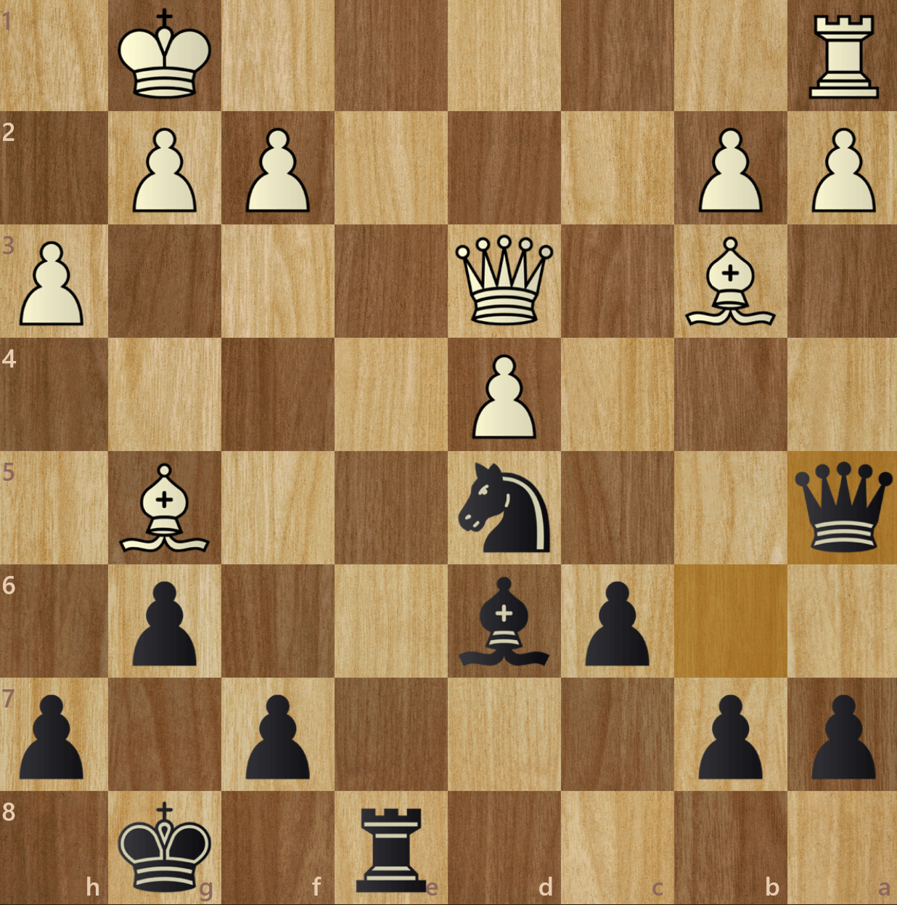
</img>

<i>双方均选择了最流行的短易位，战局节奏会更平缓</i>

下图所示，白方选择了长易位，黑方选择了短易位。白方会利用左侧的小兵冲击黑方的保护罩，黑方则利用右侧的小兵冲击白方的防护罩

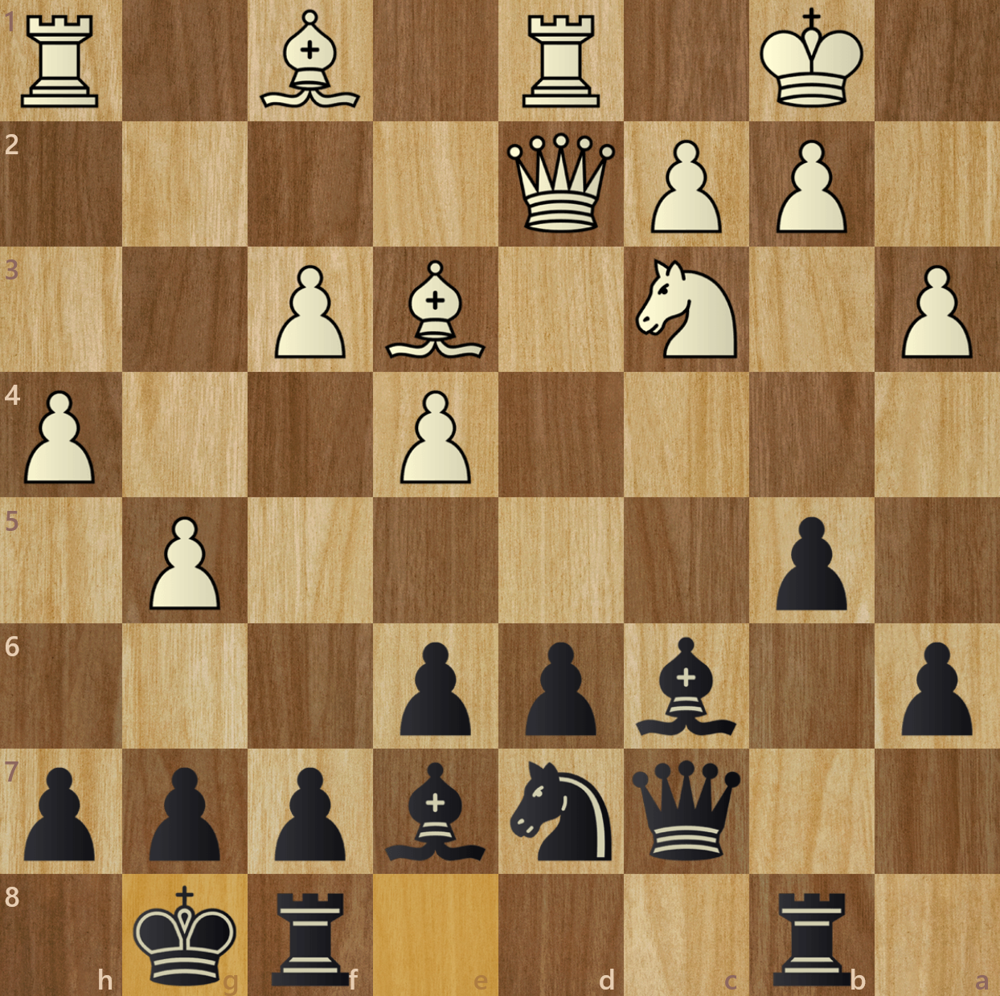
</img>

<i>双方都试图以最快的速度破坏掉敌方国王的保护罩。这种非对称的易位方式加快了战局速度，变得更刺激</i>

由于王车易位这个规则的存在，象棋的作战节奏变得平缓，和棋概率极大（顶尖选手的和棋概率大概在 50% 左右 [2]）。观看完最新一代的深度神经网络象棋程序 AlphaZero 的比赛后，前世界冠军 Kramnik 提议道废除王车易位的规则 [3]，以便让象棋作战风格变得更有趣，减少和棋的概率。

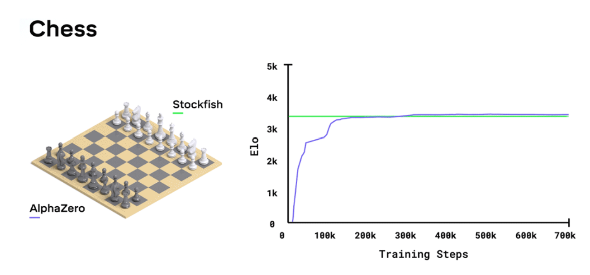
</img>

<i>AlphaZero 是一个可以自主学习的深度神经网络，在没有人为干预的情况下，独立发现了象棋开局知识 [4]，经过数小时的自我训练便可击败最顶尖的象棋对战程序 Stockfish。</i>

国王真正发挥作用的阶段是残局，当绝大多数的重型火力部队被消耗殆尽，国王会进入战斗模式，和残余部队并肩作战，守护着幸存的小兵进行升变。

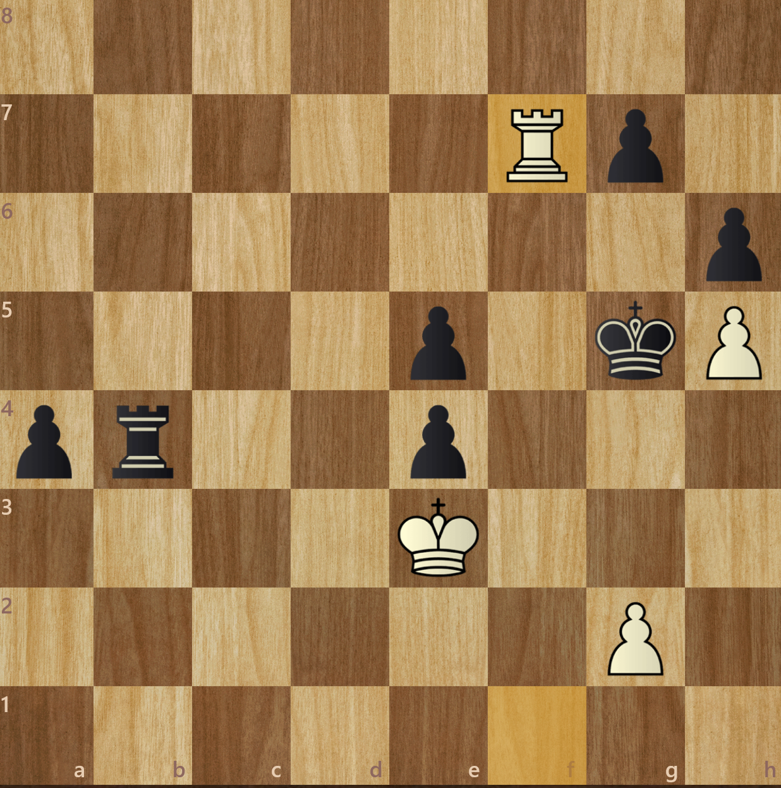
</img>

<i>在车（Rook）的帮助下，双方国王都在蚕食对方小兵，同时协助己方小兵的升变</i>

## 国际象棋变种-Chess960

传统的国际象棋经过数百年的对弈，数不尽的开局方式被过去的顶级大师所发明，死记硬背开局知识已经成了当代顶级象棋大师对弈的必修课（站在巨人的肩膀上）。如果你不按照已经发明的序列行棋，你会很有可能被更熟悉开局知识的对手击败。超过 10 步以上的开局序列比比皆是。

被称为 Ruy López Opening: Marshall, Main line, Spassky Variation 的开局，序列长度有 18 步

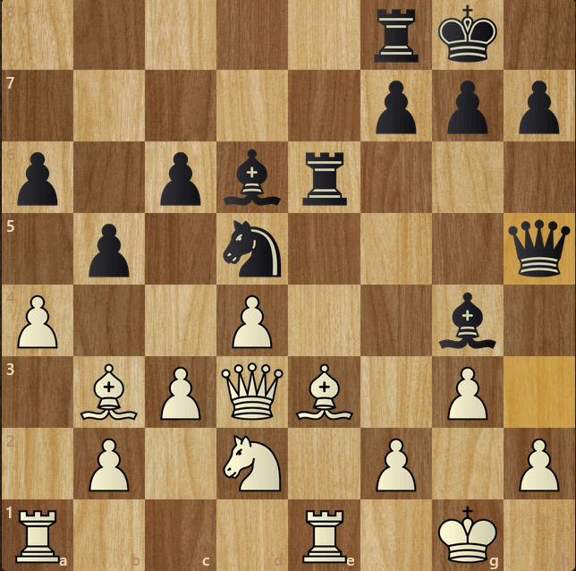
</img>

<i>Ruy López Opening: Marshall, Main line, Spassky Variation 的第 18 步</i>

由于强大的国际象棋电脑程序在上世纪 90 年代的兴起，越来越多的开局序列被研究和发明，因此，顶级大师对弈所需要记忆的开局知识越发庞大和复杂。在这个背景下，曾经的世界冠军，费舍（Bobby Fischer）对现代国际象棋充满死记硬背的对弈深恶痛绝。

</img>

<i>1972 年的世界冠军费舍。因为凭一己之力击败了苏联象棋国家队，被视为美国的英雄，一时间家喻户晓</i>

在前人已经发明的随机象棋（打乱了国际象棋的开局棋子摆放位置）的基础上，他改良了一些规则，诞生了名为 Chess960（也称 Fischer Random Chess）的国际象棋变种

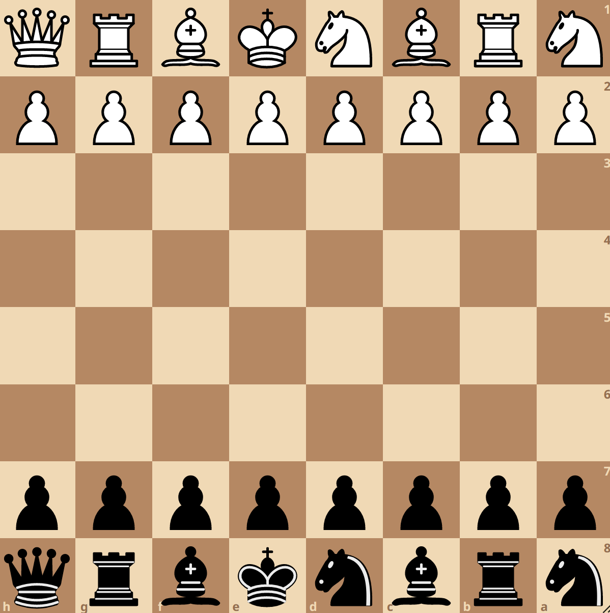
</img>

<i>费舍改良了随机象棋，发明了 Chess960。名字缘由是因为存在 960 种不同的棋子开局摆放位置</i>

Chess960 存在 960 种不同的开局棋子摆放位置，使得顶级大师的对弈无法再依赖于前人发明的开局知识，彻底变成了考验洞察力和行棋水平的象棋对弈。FIDE 在 2019 年举办了首次 Chess960 世界冠军争霸赛，冠军是卫斯理（Wesley So）

</img>

<i>卫斯理是首届 Chess960 的世界冠军，也是世界前五的顶尖传统国际象棋特级大师</i>

## 今日 YouTube 频道
agadmator's Chess Channel：主播位于东欧小国克罗地亚。这是 YouTube 有史以来第一个第一个订阅量破百万的象棋类频道，在疫情前几年对象棋在全世界流行的推广起到了关键性的作用。

他的频道主打象棋的历史，涉及从三百年前欧洲大师级棋手著名的对战，一直到现在的世界冠军争霸赛。他的讲解充满了各种象棋的历史和奇闻趣事，每次还会刊登一条著名棋手的名言。想了解象棋历史，他的频道必不可少。

他的宠物狗 Medo，在他讲解的时候，喜欢在背景的沙发上搔首弄姿，因此也成了这个频道的吉祥物。

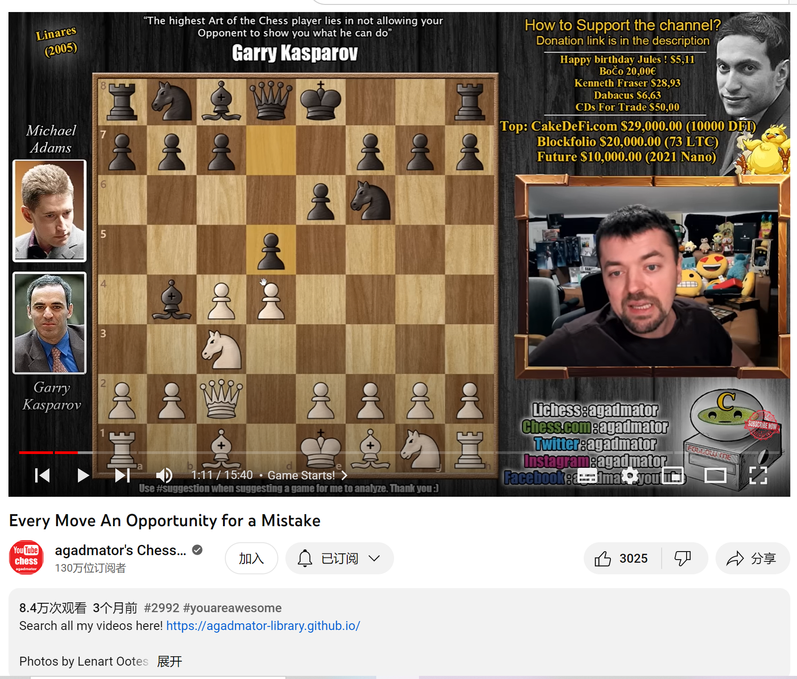
</img>

<i>agadmator's Chess Channel 主打历史上的精彩对战</i>

## 冷知识

利用象棋来推崇社会道德和发扬善行，杰索利萨（Jacobus de Cessolis）撰写的《论棋艺》（The Book of Chess）是在公元 14 世纪，在欧洲，当时很有可能是仅次于《圣经》（The Bible）在欧洲流通量最大的图书 [1]。

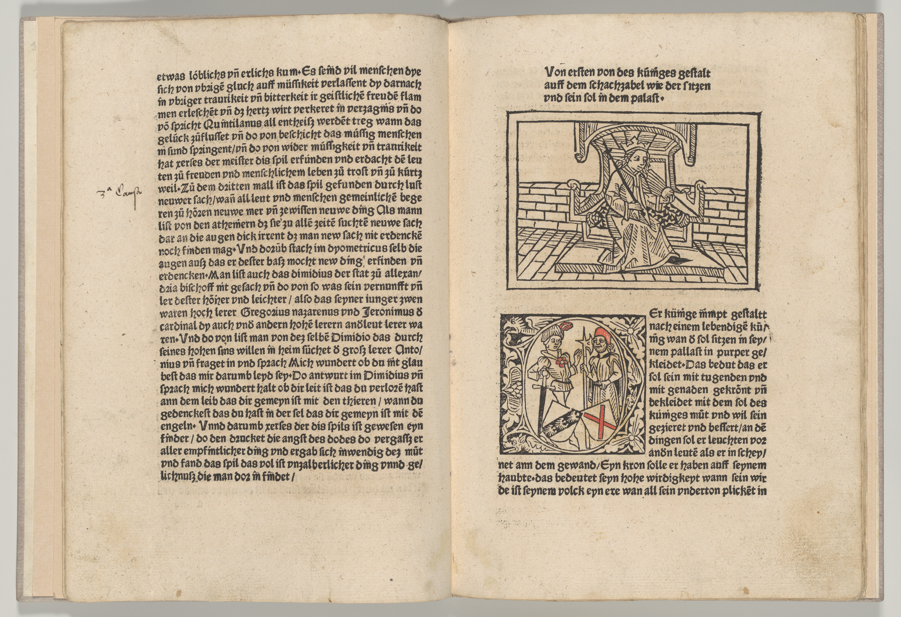
</img>

<i>《论棋艺》讲述了象棋所代表的社会道德和井然有序的社会等级</i>

## 参考文献
[1] Shenk, David. The Immortal Game: A History of Chess. Souvenir, 2008. 
[2] Wikipedia contributors. “Draw (Chess).” Wikipedia, 16 Feb. 2024, en.wikipedia.org/wiki/Draw_(chess).
[3] Mukhuty, Satanick. “No-Castling Chess - Vladimir Kramnik Proposes an Exciting Variant!” ChessBase India, www.chessbase.in/news/No-Castling-Chess-Vladimir-Kramnik-proposes-an-exciting-variant-.
[4] Schreiner, Maximilian. “AlphaZero Learns Human Concepts.” THE DECODER, 5 Dec. 2022, the-decoder.com/alphazero-learns-human-concepts.