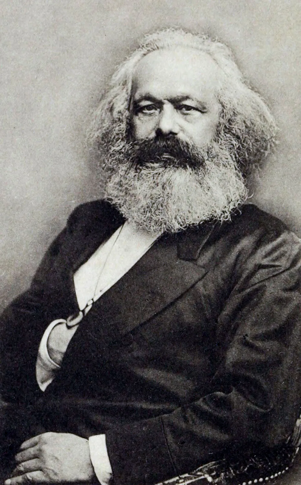
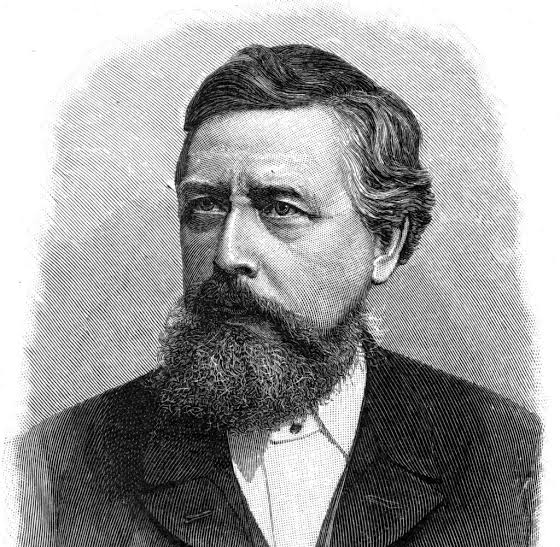
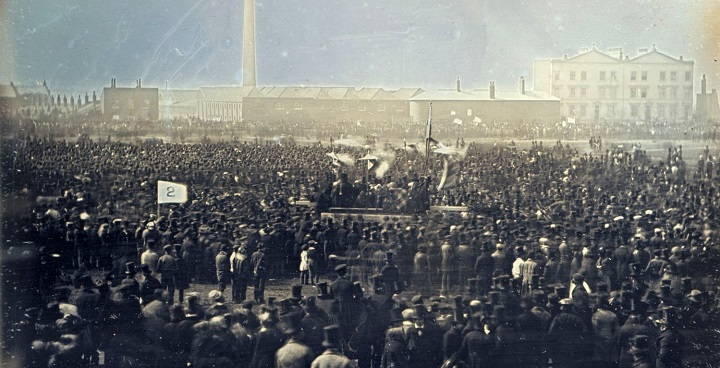
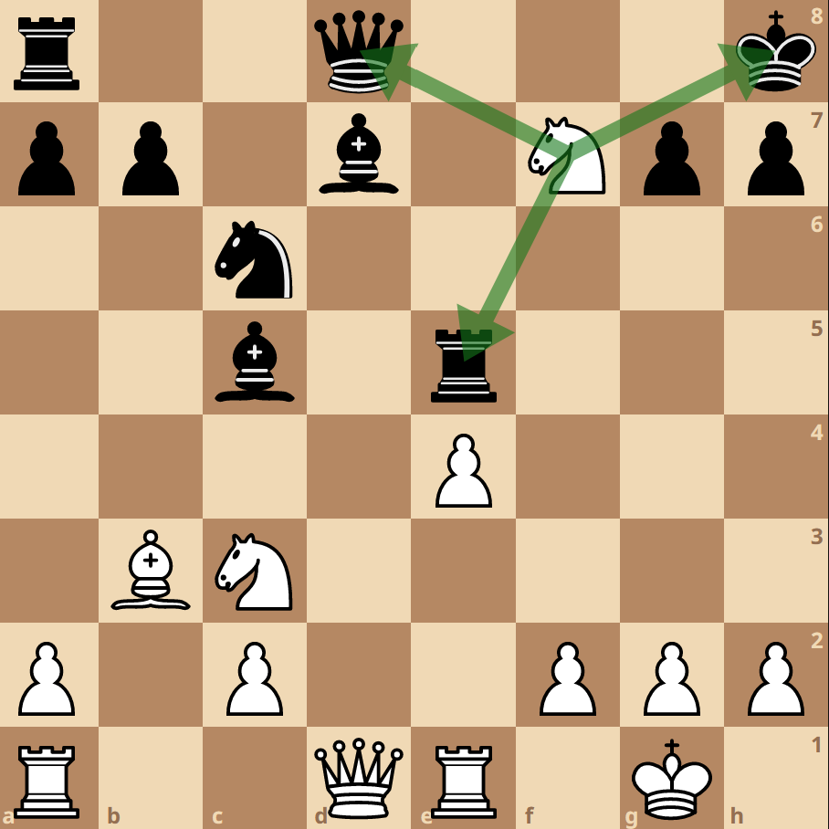
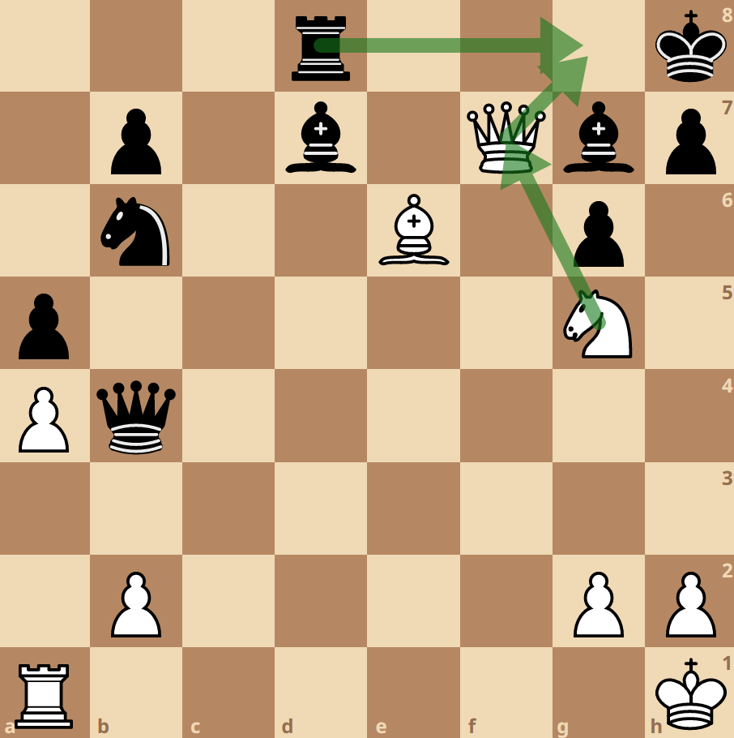
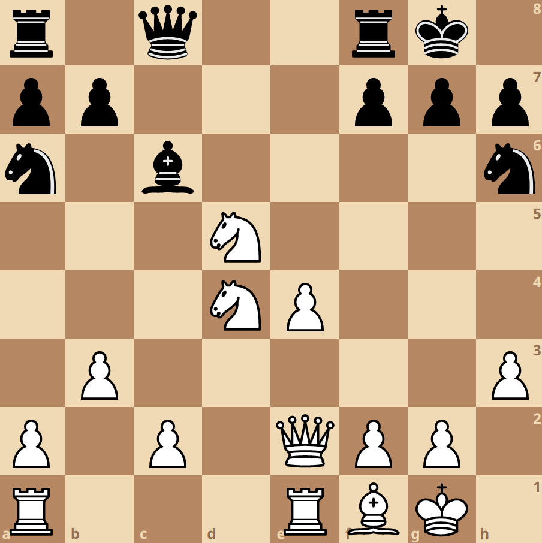
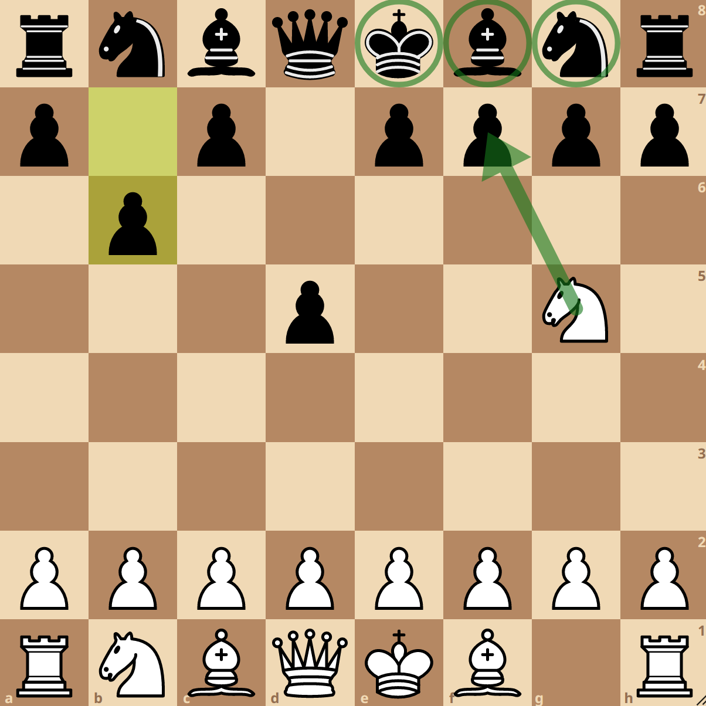
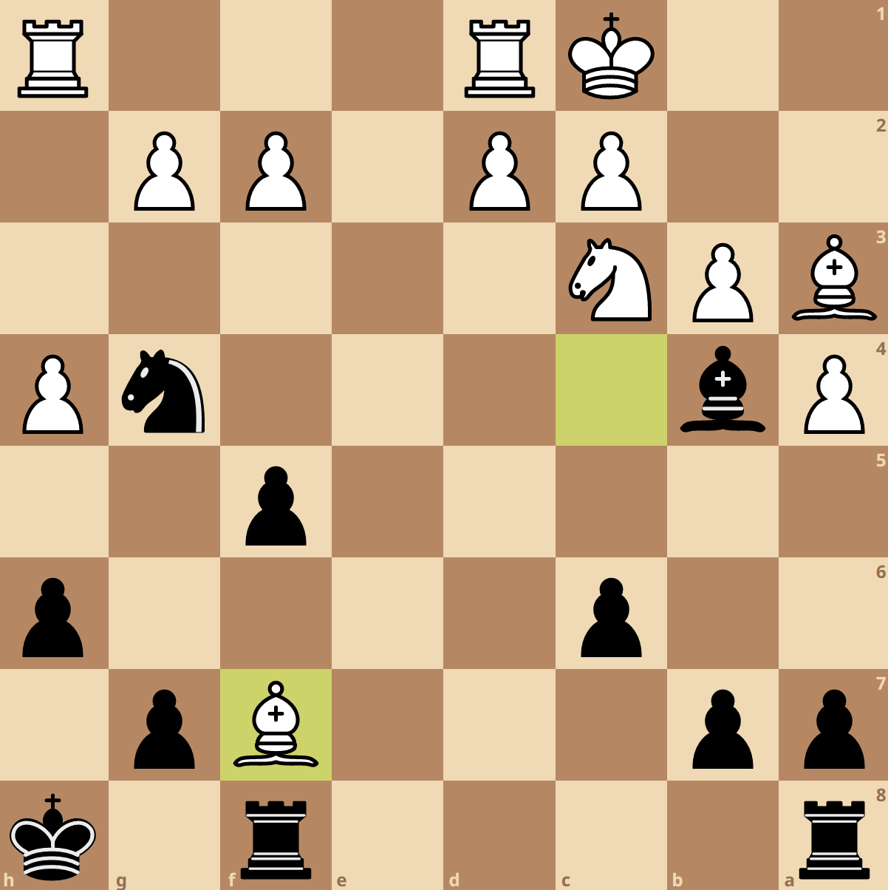
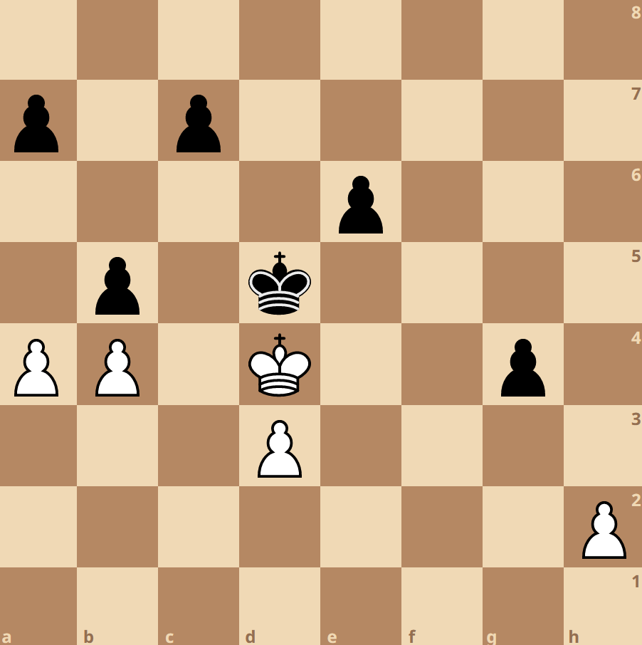
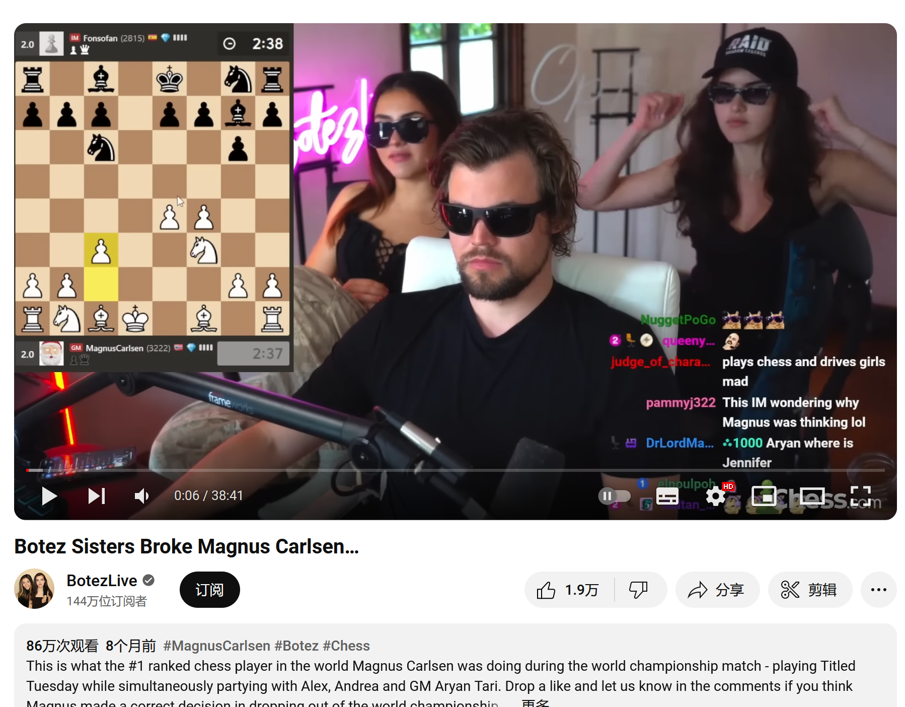

# 第五讲

马克思（Karl Marx）盯着棋盘，沉思下一步的策略；坐在他对面的对手李普可奈卡（Wilhelm Liebknecht）时不时瞟一眼对面的马克思，耐心地等待着他的下一步走棋 [1]。

</img>

<i>《资本论》以及《共产党宣言》的作者马克思</i>

</img>

<i>李普可奈卡，德国社会民主党创始人之一。在他的领导下，德国社会民主党成为了德国最大的政党</i>

这是在 19 世纪 50 年代的伦敦。工人运动和国际共产主义运动在欧洲声势正旺。但是在伦敦，马克思的家中，两位社会主义运动的巨头暂时忘掉了革命、起义，以及工人运动，而是专心致志地研究眼前的棋盘，想办法击败对方。

</img>

<i>1848 年，宪章派示威运动（The Chartist march）总共收集了两百万签名，示威者向议会请愿将授予富人和权贵的投票特权下放给普通老百姓</i>

马克思是一个狂热的棋手，虽然水平不是特别精湛，但是痴迷于象棋。他会邀请朋友，在嘈杂和吵闹声中，在他伦敦的家中进行漫长而喧嚣的象棋比赛。他的妻子和女仆则对这些烦人的吵闹声痛恨至极。

在和李普可奈卡对弈的当天，两人马拉松式的从早下到晚上。马克思输了一连串比赛，被复仇心态冲昏了头脑的马克思想多下几盘，扭转战局。但是李普可奈卡不愿意呆到太晚。马克思极不情愿的终止了当天的比赛，并严正要求李普可奈卡第二天继续比赛。

第二天早上，李普可奈卡如约来到了马克思的家中，但是他能感受到马克思家中气氛的紧张。他回忆道：“马克思夫人没有露面，女仆也没有给我好脸色看。本来我想问问出了什么问题，马克思来到了房间，和我握了握手，然后立刻拿出了棋盘。”

比赛正式开始，马克思展现出了一丝冷幽默。交谈中，李普可奈卡得知马克思昨晚并没有睡好觉，而是熬夜分析改进他的行棋策略。他的努力没白费，接下来的比赛中，马克思开始逐渐占据上风。马克思的态度也开始发生变化，开始变得更加幽默和友善。不幸的是，李普可奈卡逐渐找到了反制马克思的战略，马克思再一次在棋盘上处于劣势。随着战局的恶化，马克思开始变得非常激动，大声吵闹。李普可奈卡描述道：“马克思夫人仍然没有露面，他的孩子们也没人敢在两人竞争白热化时候，进入房间。”

比赛一直持续到深夜，李普可奈卡连赢了两局。马克思大声嚷嚷着要再来一把，并立刻开始摆放棋子，准备下一局比赛。这个时候女仆进入房间，带着马克思夫人的旨意，直视马克思的双眼，严厉的说到：“不准再下了”。

看到马克思被骂，愧疚的李普可奈卡立刻离开了。

第二天，李普可奈卡非常惊讶的收到了女仆的来访。她给李普可奈卡捎带了马克思夫人的话。马克思夫人将会禁止在她家中的一切象棋比赛，并抱怨道她的丈夫输了比赛后态度会变得相当不友好。李普可奈卡意识到马克思对象棋的痴迷已经让他们本不富裕的家庭雪上加霜。他说到：“马克思输掉比赛后的怨气全撒到了他的夫人身上，她彻底丧失了对她丈夫的耐性。”

自打那以后，尽管马克思一直在邀请，但是李普可奈卡遵从了马克思夫人的意见，不再去他家中下棋。

## 今日明星- Knight

马（Knight）是棋子中走位最奇怪的一个，和直来直去的其他棋子不一样，它走的是 L 型。这种反直觉的走位方式使得马成了国际象棋最让人害怕的一个棋子。马神出鬼没，有的时候，敌方的马会在你意想不到的时候，同时攻击你好几个重要的棋子，这被称为 Fork。

</img>

<i>白马同时攻击了黑方的王、皇后以及车，当皇室家族的两个成员同时被马攻击的时候，被称为 The Royal Fork。这是最能让对手恼羞成怒的攻击方式之一</i>

几乎所有人都会遇到这种恼人的情景：你的国王和皇后分隔老远，敌方的马也离你很远，看起来没有任何危险。突然，这只马跳到了战场中间，同时攻击了你的国王和皇后，这时候，你只能牺牲掉你的皇后，保护你的国王。你会瞬间血压升高，气急败坏。破口大骂和拔网线都是常见的反应。

正是因为马奇特的走位方式，利用马进行将军也成为了观赏性最高的将军方式。其中一个相当著名的将军方式被称为窒息将军（Smothered Mate）。这个独特的名称来源于国王很像是窒息而死。

</img>

<i>白方牺牲掉皇后，将黑车引入到黑王的周围，完成包围，然后白马跳到原来白后的位置，完成将军</i>

马可以同时攻击周围 8 个地盘，因此，马一般会进入棋盘中心以发挥最大效用。尽量避免让马跳到棋盘的边缘，因为这会对将马的攻击力减半。

</img>

<i>白马在战场中心，控制着广大的地盘，而黑马在战场边缘，攻击力减半</i>

## 国际象棋变种-Atomic

核弹棋（Atomic）源于上世纪 90 年代，最大的特色是将棋子变成了威力惊人的小型核弹。当你吃掉敌方的棋子时，也同时会引爆这个棋子，周围一圈的棋子（只有周围的小兵对爆炸免疫）都会被炸掉，当你炸死了敌方的国王时，你就赢了。

</img>

<i>白马下一步会进攻箭头所指的黑兵，并随之引爆这个黑兵，国王在爆炸圈内，会被炸死，白方获胜</i>

正是由于这个奇特的爆炸规则，你会在核弹棋中见到一些啼笑皆非的情况。你可以用你的棋子进行自杀式袭击，敌方也不敢对你的棋子轻易下手。或者两个国王打照面这种情况也会发生

</img>

<i>如果是在常规象棋，白象和黑象所在的位置相当于严重失误，但是在核弹棋，你却随处可见这种奇特的战术，这是因为每一个棋子都是一个小型核弹，一旦吃掉它，会炸死周围的部队，因此吃掉白象，或者是黑象只能算是同归于尽</i>

</img>

<i>两个国王碰到了一起，但谁也无法吃掉对方，因为这会导致同归于尽</i>

## 今日 YouTube 频道
BotezLive：主播是 Botez 姐妹，她们早年均有过一段职业象棋比赛生涯。其中 Alexander Botez 被称为最漂亮的女棋手。

</img>

<i>Alexander Botez 被称为最漂亮的女棋手。她们的频道已经有一百万的订阅量</i>

由于 Alexander Botez 经常在象棋对弈中粗心大意的丢掉自己的皇后，因此不小心丢掉皇后的战术失误，被戏称为 Botez gambit。

</img>

<i>作为异性的 Botez 姐妹给男人主导的象棋世界带来了一丝新奇</i>

## 冷知识

史蒂芬·霍金（Stephen Hawking）是一名相当出色的棋手，据称他的等级分超过了 2000 [2]。他还曾经网上进行了一场量子国际象棋对战 [3]。量子象棋引入了叠加态这个量子世界的独特规则，让一个棋子可以同时出现在棋盘的多个地方。

</img>

<i>霍金在网上进行了一场量子象棋的对战</i>

## 参考文献
[1] Hudson, Michael Andrew. Storming Fortresses: A Political History Of Chess In The Soviet Union, 1917-1948. Diss. UC Santa Cruz, 2013.
[2] Stefano, Meroli. From Physics to Checkmate: Delving Into the Chess Skiils of Einstein, Fermi, and Other Renowned Intellectuals. meroli.web.cern.ch/lecture_scientist_chess.html.
[3] IQIM Caltech. “Paul Rudd Explores the Quantum Realm With Stephen Hawking.” YouTube, 27 Jan. 2016, www.youtube.com/watch?v=Hi0BzqV_b44.