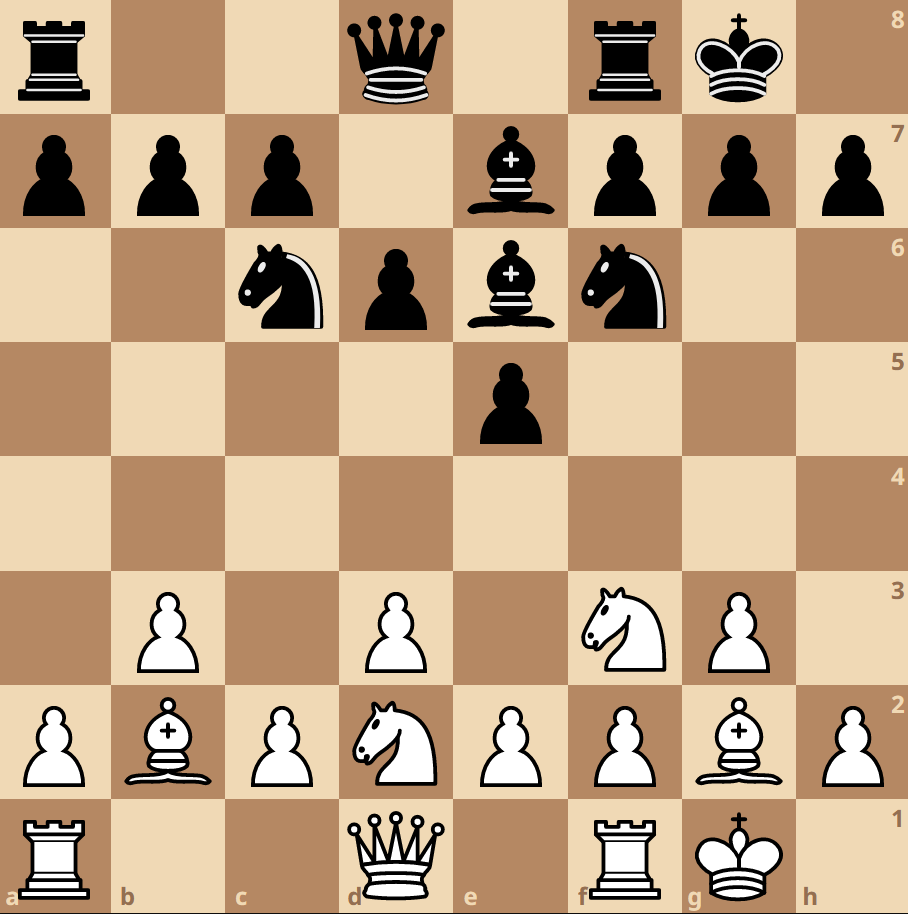

# 第六讲

面对残局的劣势，尼波（Ian Nepomniachtchi ）知道自己无力回天。失望、愤怒和痛苦在他心中翻滚，这是他获得世界冠军头衔最近的一次机会，但是他还是失败了，下意识中，他颤抖的手摸着黑方的棋子，打翻了几个掉落到了地面，在场所有的人都注意到了这一幕。这是 2023 年世界国际象棋冠军赛，来自中国的丁立人和俄国的 Ian Nepomniachtchi 在哈萨克斯坦，进行了一场长达 21 天马拉松式的比赛，角逐世界冠军称号，获胜者将会获得高达 120 万欧元的奖金（约合人民币 930 万元）。两人的等级分相差不多（丁立人：2788，Ian：2795），也就是说两人各有 50% 的胜率赢得比赛。

</img>

<i>在巨大的精神压力下，Ian 颤抖的手打翻了黑方的棋子，掉落到了地上</i>

前世界冠军 Magnus Carlsen 自愿放弃了世界冠军头衔。历史上，只有两个世界冠军放弃保卫自己的头衔，第一个是1948年，法籍俄国人 Alexander Alekhine，在比赛前发现死在一个旅馆内。由于 Alekhine 和苏联政府交恶，不排除有谋杀的可能性 [1]；

</img>

<i>Alexandre Alekhine，第四任世界冠军</i>

另一个是美国人 Bobby Fischer，1975 年的时候拒绝面对来自苏联的 Anatoly Karpov 的挑战，自动放弃了冠军头衔

</img>

<i>Bobby Fischer 不愿参赛的原因众说纷纭，这两个世界上最顶尖的棋手从来没有能在世界冠军争霸赛上较量</i>

值得一提的是，他依然是实力最强的棋手，他的等级分在 2840 左右，如果他愿意保卫自己的世界冠军头衔，仍然没有人能有足够的实力去挑战他。他认为在 “典型对弈（Classical Chess，一种时间非常长的对弈）” ，开局知识如此之繁多，以至于两个顶尖棋手已经没有机会能够自由发挥，而是干巴巴的按照开局知识来走棋，他开始对这种长时间的对弈失去兴趣。他认为时间更短的对弈能让棋手更好的自由发挥 [2, 3]。

</img>

<i>前世界冠军 Magnus Carlsen 仍然是世界上实力最强的棋手</i>

丁立人的冠军之路被视为一个小小的奇迹。参与世界冠军争霸赛的前提是需要进入预选锦标赛，丁立人并没有入选。由于俄国选手 Sergey Karjakin 公开支持俄国入侵乌克兰的战争，被 FIDE 剥夺了入选资格。空出来的位置丁立人是最佳的人选，但是由于当时中国仍处于严格的疫情管控，虽然他完全有实力，丁立人却无法去国外参加足够的比赛来入选。为了帮助丁立人获得入选资格，中国棋联加急在国内组织了数场比赛，目的就是为了让他能获得足够多的比赛次数从而顺利满足入选锦标赛的条件 [4]。

赢得世界冠军头衔后，丁立人发表了一些感想：
> 这场比赛代表了我内心深处的体验，很难控制自己的情绪，我肯定会哭的，对我来说，这是一场非常艰难的比赛，现在我觉得我终于可以放松下来了。

## 今日明星- Bishop
象（Bishop）在传统的印度象棋中是大象，但是欧洲人没见过大象，因此改成了基督教中更熟悉的主教。

</img>

<i>Bishop 是基督教教堂中的神职人员</i>

由于象的长距离对角线攻击的特色，捷克语中的象被称为火枪手，在克罗地亚语中则被称为弓弩手 [5, 6]。

</img>

<i>在一些东欧国家，象被称为弓弩手</i>

象和马都是前期作战的主力部队，因此也是最早阵亡的部队之一。象既可以用来进攻，也可以通过相当流行的 Fianchetto 布阵方式成为禁军，保卫国王。

</img>

<i>白方 Fianchetto 两个象，其中一个保卫国王，另外一个显著增加了它的攻击范围</i>

象有的时候可以用来瘫痪敌方部队,这被称为钉住 (getting pinned)

</img>

<i>白象钉住了黑车, 黑车动弹不得</i>

虽然象和马的权重差不多，但是两个象的威力一般来说要大于两个马，因此在有可能的情况下，棋手会优先选择保存象而舍弃马。

## 国际象棋变种-Fog of War

战争迷雾棋（Fog of War）借鉴了现代即时战略类电子游戏中常见的战争迷雾，比如说红色警戒、魔兽争霸，以及星际争霸。

</img>

<i>战争迷雾是即时战略游戏中常见的特色，比如说红色警戒</i>

因此部队的排兵布阵也增加了一个重要的环节，即探明敌方情报。正因为迷雾的存在，国际象棋加入了运气因素，同时打法变得更加保守。

</img>

<i>没有被探明的领域会被战争迷雾包裹，你需要派遣先头部队查明敌情</i>

敌方领土内没有被己方棋子攻击到的地区被迷雾笼罩，你需要派遣先头部队攻击这些迷雾地块，消除迷雾，以查明这个地块的敌方部队情况。不过要小心，你的侦察部队是在冒着生命危险获取情报，为你的侦察部队提供足够的炮火支援是基本功。要注意，你的领土对于敌方也是布满了迷雾，如何利用迷雾去欺骗对手，声东击西，也是战争迷雾棋的艺术。

皇后的进攻风格变得更加谨慎，如果说常规象棋中的皇后风格谨慎，那么战争迷雾棋中，皇后谨慎程度又上了一个台阶，几乎很少出门，主要作用就是给先遣部队提供足够的火力支援。

</img>

<i>白方利用象驱逐迷雾，获得情报，皇后给象提供火力支援</i>

## 今日 YouTube 频道
Daniel Naroditsky：主播是个年轻的 GM，毕业于斯坦福大学。他是最顶尖的网络象棋棋手之一，曾多次摘得 chess.com Elo 第一的桂冠。他的作战风格凌厉，拥有极强的直觉，能在极短的时间内组织别具一格的战术，颇让对手胆寒。

他象棋天赋禀异，在 14 岁的时候，就已经出版了 _Mastering Positional Chess_ 一书。

在参与和顶尖 GM 较量的同时，他也会发布很多新手友好的教学视频
。从开局、中局到残局，他是一个及其出色的象棋老师。

</img>

<i>在对战中，Daniel Naroditsky 会用简洁易懂的语言，分析自己的思考过程</i>

## 冷知识
国际象棋高手和普通玩家有什么区别？高手在考虑下一步的时候，往往会潜意识里，做最坏的打算，也就是说，他们高估风险，喜欢万全之计。而普通玩家则做最乐观的打算，也就是说，低估风险。有趣的是，最强大的一批象棋对战程序采用的 minimax 算法，恰恰就是借鉴了 “做最坏打算” 这一思想 [7]。

</img>

<i>minmax 算法是很多顶尖象棋程序的核心算法之一</i>

同样的区别也发生在生活的角角落落。做最坏的打算成为了一些翘楚们最喜欢的思考方式之一 [8, 9]。

## 参考文献
[1] https://www.chesshistory.com/winter/extra/alekhine3.html
[2] Rao, Rakesh. “Magnus Carlsen: Future of Classical Chess a Little Bit Dubious.” Sportstar, 19 Nov. 2020, sportstar.thehindu.com/chess/magnus-carlsen-online-chess-classical-format-chessable-masters-world-championships-sports-news/article33133382.ece.
[3] Svensen, Tarjei J. “Carlsen on Lack of Motivation, Classical Chess, New WC Formats &Amp; Family Life.” Chess.com, 2 May 2023, www.chess.com/news/view/carlsen-on-his-future-personal-life-motivation-and-more.
[4] “World Chess Championship 2023.” Wikipedia, 10 Feb. 2024, en.wikipedia.org/wiki/World_Chess_Championship_2023.
[5] http://www.shakki.net/kerhot/KemTS/nap-pieces.htm
[6] Ostria, Jenna. “The History of Chess Bishops (and Why They Have a Cut on Top).” Chess Area, 29 Oct. 2022, chessarea.com/the-history-of-chess-bishops-and-why-they-have-a-cut-on-top.
[7] https://papachess.com/blog/how-does-stockfish-work#the-algorithm-behind-stockfish
[8] https://jamesaltucher.com/blog/seven-things-learned-chess/
[9] Taleb, Nassim Nicholas. The Black Swan: The Impact of the Highly Improbable. Penguin UK, 2008.