# 第四讲

1774 年，富兰克林（Benjamin Franklin），美国早期的外交家，科学家，同时也是一位杰出的棋手，正在伦敦。很不幸，他所在的那个时代政治气氛非常紧张。由于贸易和税收问题，英国朝野开始对北美洲的定居者成立的联合区（后来的美国）有越来越严重的抵触情绪。

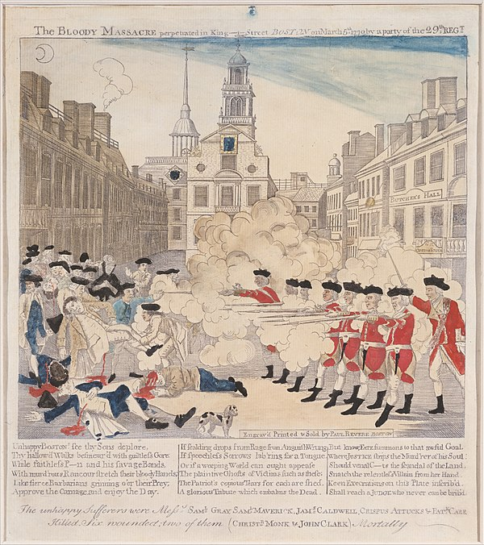
</img>

<i>1770 年，波士顿示威居民和英国军队发生冲突，造成 5 名居民以及 1 名士兵死亡</i>

尽管如此，当他收到郝乌小姐（Lady Howe）的来信 [1]，他还是非常高兴。郝乌小姐邀请他去她家去进行象棋比赛。第一次比赛，他们相谈甚欢，于是同意日后，同样在郝乌小姐的家里，进行第二场比赛。

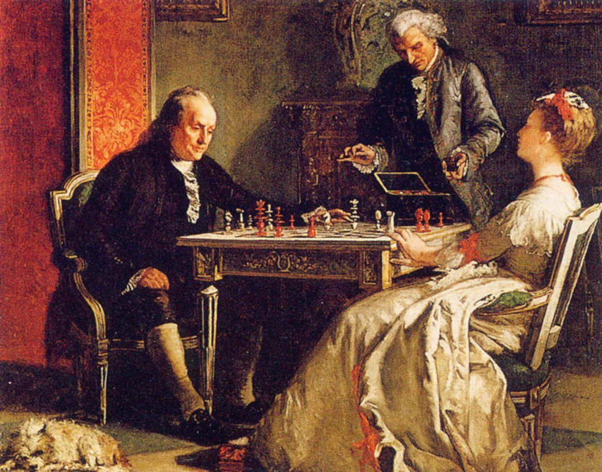
</img>

<i>富兰克林和郝乌小姐下棋</i>

一开始，他们在棋盘上讨论数学问题，但是不一会儿，郝乌小姐突然话锋一转，开始讨论当时的政治局势。“北美联合区和英国的矛盾该怎么解决？我希望双方不要卷入一场战争，两方应该像朋友一样互相尊重” [2]。随后，她直白的讯问富兰克林愿不愿意为英国和北美联合区的和解做出努力。

富兰克林回复说他愿意，他乐观的认为两国并无本质上不可调和的矛盾，只是缺乏合适的沟通渠道。

富兰克林评论道：“这其实只不过是一些琐碎的细节问题，如果大家都理智一点，两三个外交官差不多就能解决。”

自古到今，从中国到欧洲，象棋一直代表着战争，一场不流血的，头脑中的战争。将军和士兵们喜欢用象棋来打磨军事战略，训练军事战斗技巧。也许富兰克林意识到了整件事情的讽刺性，两个敌对国家，正在逐步滑向战争边缘。而他俩，则利用下棋的时间，讨论如何缓和战争。他们的第三次相遇，是在当年的圣诞节。让富兰克林惊讶的是，郝乌小姐的哥哥，权倾一时的郝乌公爵（Lord Howe）正在房间里安静的等待他的到来。

郝乌公爵是英国政府中鸽派势力的代表，他们希望能够避免和北美联合区即将发生的军事冲突。郝乌公爵询问富兰克林是否愿意做出最后一次外交尝试，避免即将到来的战争。富兰克林欣然答应了。利用在郝乌小姐家中的象棋比赛作为掩护，富兰克林和郝乌公爵进行了一项长达两个月的，秘密的外交斡旋。

他们的努力失败了，英国的鸽派无法获得足够的政治支持，三个月后，富兰克林回到了北美，紧随其后，美国独立战争爆发。

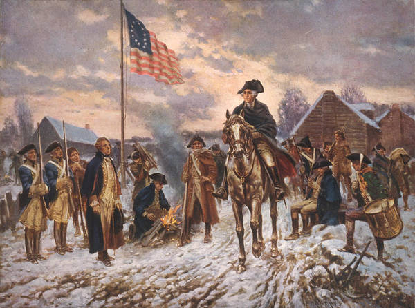
</img>

<i>美国独立战争，1775~1783</i>

## 今日明星-Pawn

小兵（Pawn）是棋盘上最弱小的部队，Pawn 在英文中也充满着歧视色彩，一般可以翻译为炮灰。但是 18 世纪最顶尖的棋手费里多（Philidor），在研究了无数的棋谱后，写下了这么一段话

> 我希望可以发现前人未曾研究，或者未能投入实战的战略。这个战略便是兵的巧妙运用。**兵是象棋的灵魂**，兵的布阵决定了进攻和防守，同样也决定了输赢。
> — <cite>Philidor<cite>

</img>

<i>费里多是 18 世纪最顶尖的棋手，他也是一位知名的音乐家。他撰写的象棋教科书《象棋对弈分析》一经问世，便经久不衰，流行了上百年</i>

当小兵成对角线组成了一条互相保护的兵链的时候，想攻破这个兵链，你需要攻击兵链的底端，这是兵链的唯一弱点

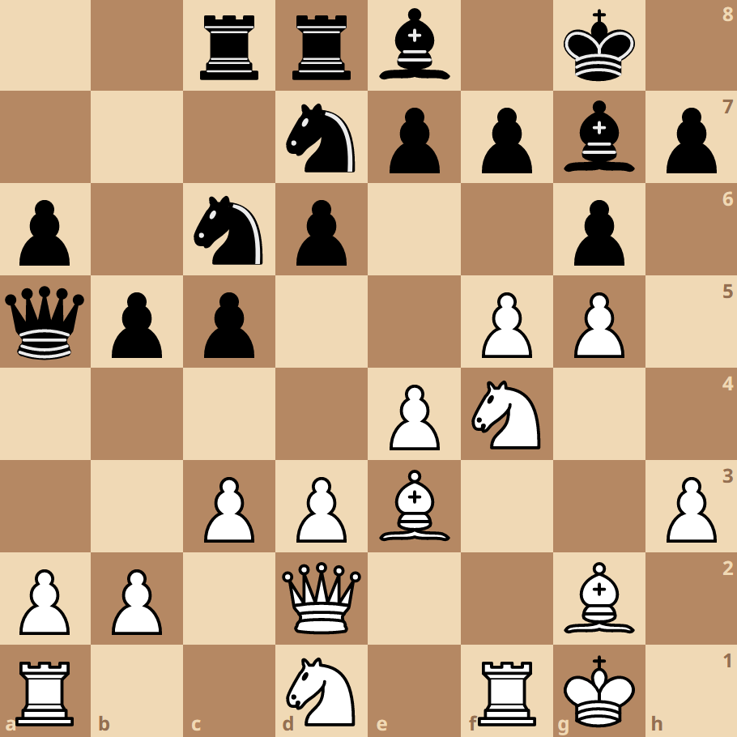
</img>

<i>白方的小兵首尾相连，互相保护，组成了一道坚固的长城</i>

最糟糕的兵阵当属叠罗汉，每一个兵都变成了弱点

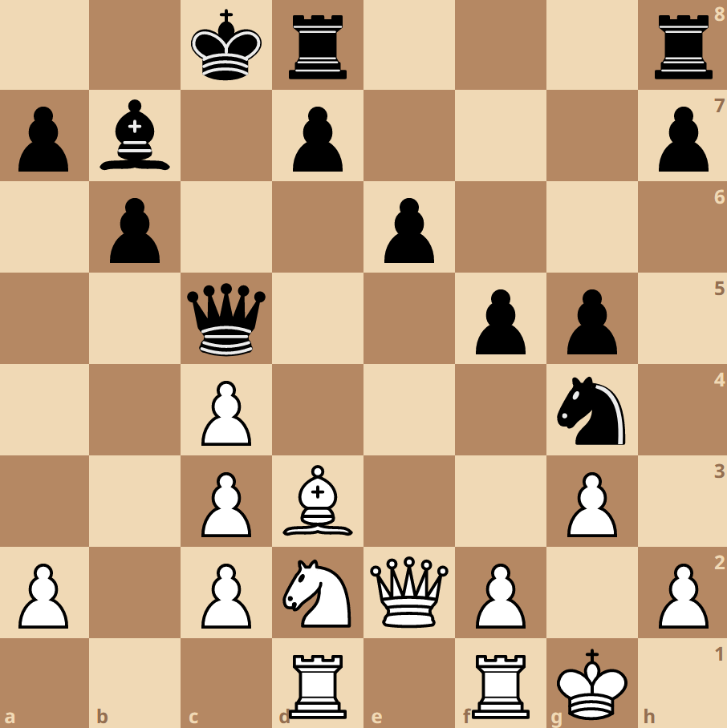
</img>

<i>白方的三个小兵叠罗汉，既无法相互保护，也无力防御黑方的进攻</i>

兵还有国际象棋中最神秘的行进方式，被称为路过吃兵（En passant）

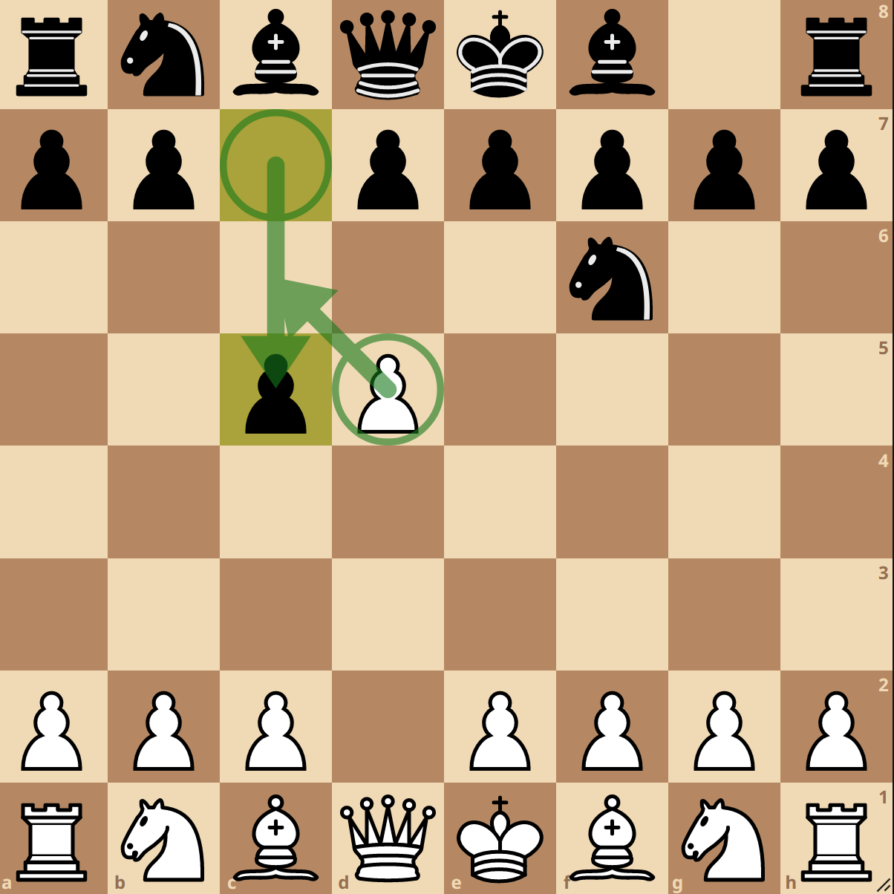
</img>

<i>黑方的小兵从初始位置往前走两步，正好经过白兵，白兵既可以选择路过吃兵，也可以按兵不动</i>

这个规则发明于 16 世纪左右，目的是为了防止小兵阻塞在一起，锁死整个战场。

象棋代表战争，战争中英勇的士兵会被获得奖励和提拔，象棋也是如此。中国象棋中的兵闯过敌方领土会获得横着走的权利，古印度象棋中的小兵走到敌人最后方会获得提拔，变成更具威力的棋子。国际象棋也传承了印度象棋的规则。

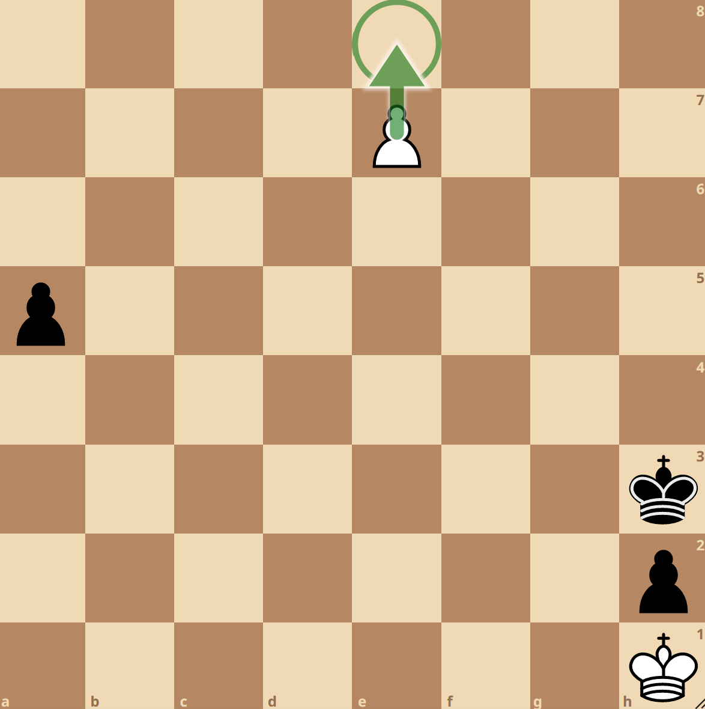
</img>

<i>白兵下一步将会踏入敌方最深处的领土，可以选择升变（promotion）成皇后、车、马、象</i>

正是因为小兵的升变带来的巨大的奖励，棋手在残局的主要战略目标便是协助自己的小兵进行升变，同时阻挡敌方的小兵升变。

## 国际象棋变种-Crazyhouse

疯人院棋（Crazyhouse）规则借鉴了日本的将棋（Shogi），棋子可以死而复生。由于这个变种极其适合网络对战，因此兴起于互联网大规模普及的上世纪 90 年代。

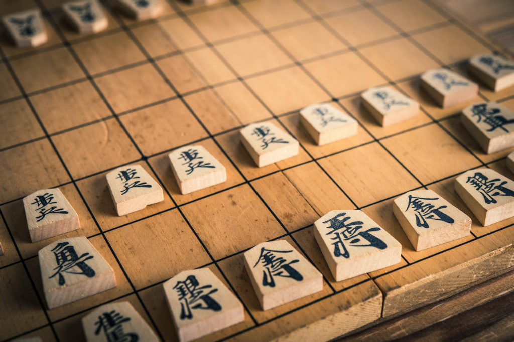
</img>

<i>日本将棋也属于庞大的象棋家族的一个分支</i>

大部分规则和普通国际象棋无异，显著的区别是你吃掉的敌方棋子可以为你所用，在每一回合有一次机会重新安放在任意空白区域（存在一些例外情况）

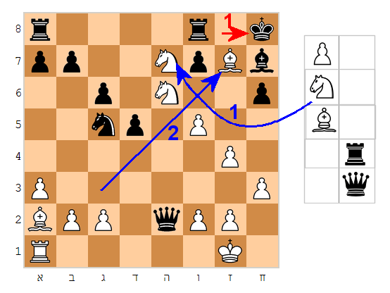
</img>

<i>一开始白方有三个备用棋子，黑方有两个。白方将备用的马按照蓝色箭头 1 放置，黑国王按照红箭头 1 躲避；白方将备用的象放置在蓝色箭头 2 放置，将死了和黑方。</i>

作为一个新的象棋变种，疯人院棋没有详尽的开局知识，也缺乏足够的策略和战法的研究。特别是棋子的死而复生，使得疯人院棋远比普通国际象棋复杂得多。正是因为它的复杂性，和围棋一样，吸引了许多 AI 的学者对于疯人院棋对战程序的研究。

## 今日 YouTube 频道
Chessbrah：主播是两个年轻的 GM，他们的视频充满了活力。被称为 speedrun 的从零开始虐新手系列视频，是观众们最喜爱的节目之一。

主播之一的 Eric Hansen 是顶尖的 bullet 棋手。完爆其他特级大师也是他的家常便饭。

他们的频道也会邀请也一些象棋界的嘉宾（其中包括前世界冠军 magnus）做客他们家中，和他们一起在 techno 音乐中进行象棋对战。

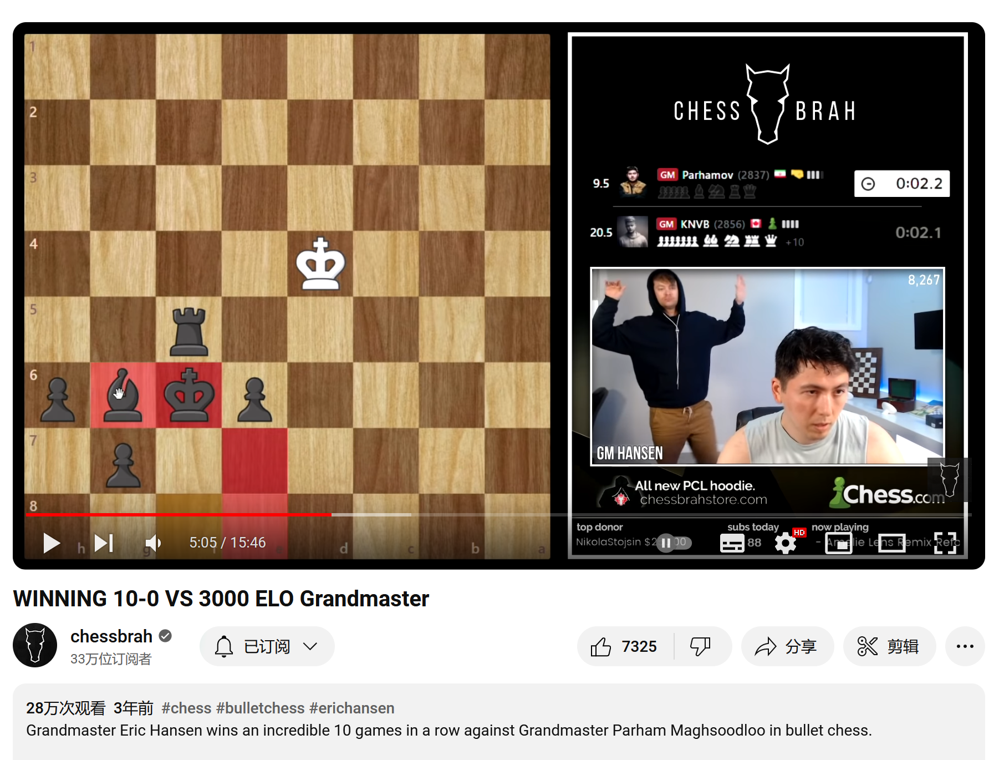
</img>

<i>Chessbrah 喜欢在象棋对战的时候背景播放 techno 音乐，古老和现代的完美融合</i>

## 冷知识

象棋在全世界范围内是一个非常流行的爱好，但是一个非常糟糕的职业。在任何一个领域，如果你属于全世界前 100 名，大量的名誉和财富会源源不断地向你而来，你至少会是一个是千万富翁；但是职业棋手，就算你是全世界前 100 名，你也会相当贫穷 [3]，更别提职业竞技带来的巨大的心理压力。无法通过职业象棋竞技来谋生的主要原因，是因为职业象棋比赛是一个小众运动，观众数量稀少，因此无法带来足够的商业赞助。

职业竞技一般都是经典时间控制（Classical time control），比赛长达3、4个小时，保守且无聊的开局，无数的平局，让人昏昏欲睡，无法提供足够的吸引力，因此不少顶尖 GM 希望可以开设更多的短时间控制对弈（Rapid, Blitz 或者 Bullet），通过这种方式来增加比赛的娱乐性和刺激程度，进而吸引更多的观众。

大部分的职业棋手会转向当教练的方式来谋生 [4]。

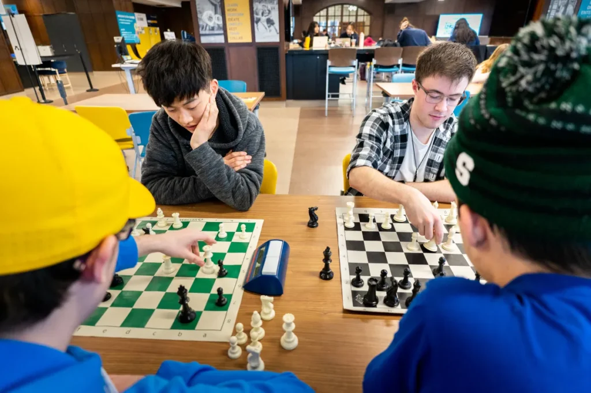
</img>

<i>象棋教练在指导下棋</i>

## 参考文献

[1] Varsity Tutors. “Ben Franklin’s Game of Love and War.” Varsity Tutors, www.varsitytutors.com/earlyamerica/early-america-review/volume-14/ben-franklins-game-love-war.
[2] Shenk, David. The Immortal Game: A History of Chess. Souvenir, 2008. 
[3] chessbrah. “Eric Discusses Why Grandmasters Are Poor.” YouTube, 12 Nov. 2023, www.youtube.com/watch?v=q98nuSyPgn4.
[4] Johnson, Daniel. "THE ROOKIE An odyssey through chess (and life)." (2017): 16-16.